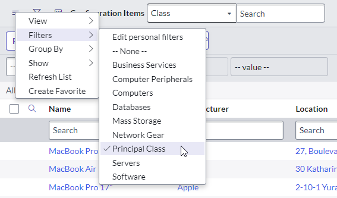

## The problem
You are a Service Desk agent and you're submitting a new incident. You go to set the "Configuration Item" field to a printer by searching for a keyword, but you get flooded with a torrent of results. You look closer and you're getting all sorts of tedious and irrelevant results that get in the way, including:
* server clusters
* database catalogs
* load balancer applications
* SAN components

[](screenshot-ci-lots-of-results.png)


What can you do?

As a ServiceNow admin, you can ask people to apply filters to their searches to only show certain CI classes, but that just adds extra steps.

Surely there's a way to filter out the multitude of little CI classes, right?

## A Principal CI Class
In a nutshell, a CI class that gets set as a **Principal CI class** is a CI class that you'd use in most people's day-to-day operations, especially in ITIL processes like incident, problem, and change management. 

Common Principal CI classes include:
* Computers and servers
* Network gear
* Printers

> Note: principal CI classes **do not** extend to child classes. Making the "Computer" CI classes a principal CI class will not automatically make principal CI classes out of "Server", "Windows server", or "Personal Computer".

By default, no classes are set as principal CI classes. The filter which filters non-principal CI classes will take effect as soon as you set your first class as a principal CI class.

Once some CI classes are set as principal CI classes, the "Configuration item" fields on most ITIL tables will be limitied to only show CI's for those principal CI classes.

You set a CI class as a principal CI class by:
1. Navigating to **Configuration > CI Class Manager**
1. Opening the class
1. Tick the "Principal CI" class and click "Save"

[](screenshot-ci-class-manager.png)

## Filtering lists
You can also filter a list of configuration items to only show CI's from principcal CI classes.

[](screenshot-list-filter-principal.png)

## How it works
Setting a CI class as a principal CI class actually saves to the "CMDB Class Information" [cmdb_class_info] table.

[](screenshot-ci-info-table.png)

On many task-related tables, especially **incident** and **problem**, there are reference qualifiers / filters on the "Configuration item" [cmdb_ci] field which will:
1. Check if the task table is included in the system property **com.snc.task.principal_class_filter**.
 Default is incident, incident_task, problem, problem_task, change_request, change_task
1. Get a list of CI classes which are principal classes by querying the "CMDB Class Information" [cmdb_class_info] table.
1. Apply a filter to only show those classes.

Here is the out-of-the-box reference qualifier for the **incident** table:
```
new TaskUtils().getConfigurationItemFilter(current);
```

`TaskUtils` calls the script include `PrincipalClass` which fetches a list of principal CI classes.