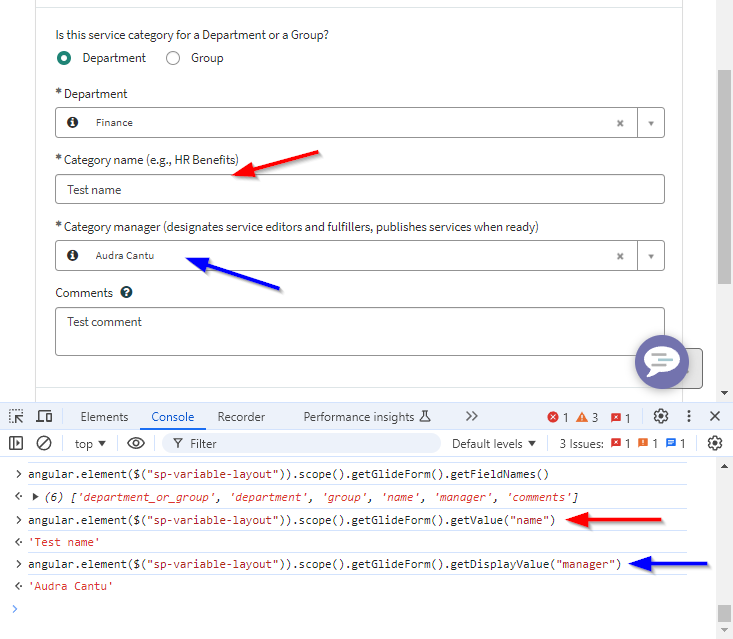
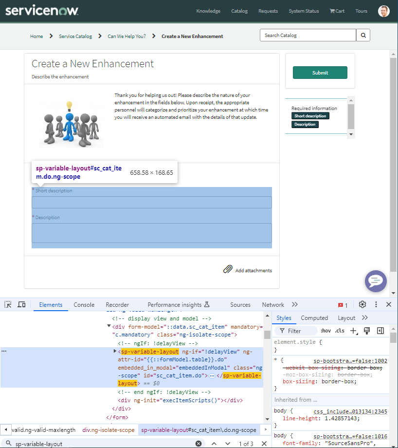

## The problem
So you're doing some work on a form or catalog item, and you're doing some debugging. Something is broken and you want inspect the form, so you open your browser's developer console and you use `g_form`.

```js
g_form.getValue("assigned_to");
```

That works great and you can see the problem, but then you try the same in the Service Portal and you get an error.

```
Uncaught ReferenceError: g_form is not defined
```

You can't use your console kung-fu to debug the issue in the Service Portal. What can you do?

## The solution
You can use this script in the browser console to get g_form from a Service Portal page. Works on both the Catalog item [sc_cat_item] general form [form] page.
```js
var g_form = angular.element($("sp-variable-layout")).scope().getGlideForm();
```

Then it works just like `g_form` anywhere else.

[](screenshot-gform-console.png)

> This script is for debugging only. Please don't use it in a widget or client script. You will make ServiceNow cry.

## What's going on?
In the Platform UI that we know and love, the GlideForm object is stored in the `window`. You could say that it's a global variable stored at the top root of the page. These two lines of code do the same thing.

```js
g_form.addInfoMessage("Hello");
// is the same as
window.g_form.addInfoMessage("Hello");
```

Pages in the Service Portal use Angular **scopes** which are like components within components within components. These Angular scopes are attached to HTML elements in the web page so we can get them by the element they're attached to. Lucky for us, the widget (Angular scope) that instantiates the form and GlideForm object stores it for later use, such as Client Scripts. We can find this scope, grab out the GlideForm from it, and use it ourselves.

If you want to poke around the different widgets (Angular scopes) to see what they look like on the inside:
1. Open your browser's developer tools then click on "Elements" to see the HTML elements of the web page.
1. Find an element that has the class "ng-scope". Right-click it and click on "Copy -&gt; Copy selector".
1. Run this script, paste in the selector in between $( and ).

```js
angular.element($("paste-selector-here")).scope();
```

[](screenshot-searching-for-scopes.png)