## The problem
There's a few reasons why you might want to modify an SLA's definition.

* The boss might decide to change the way things are measured and how they work.
* The SLAs duration or schedule might not be quite right.
* SLAs are starting, finishing, or pausing when they shouldn't be.

Either way, they're not working how they should and you want to change it.

> The rule of thumb is **do not modify SLA definitions when there are active SLAs for it. Ever.**.

ServiceNow themselves say "don't do it" here in these support KBs.

SN Support - KB0869748 Changing SLA Definitions / Schedules for 'in-use' SLAs - Best Practices
https://support.servicenow.com/kb?id=kb_article_view&sysparm_article=KB0869748

SN Support - KB0818381 SLA Definition
https://support.servicenow.com/kb?id=kb_article_view&sysparm_article=KB0818381

## The answer
In an nutshell:
1. Create a new SLA definition
2. Phase out the old SLA definition

Here's a list of how to do it:
1. Decide on a cut-over time where you'll stop using the old one and start using the new one. This can be changed during development, but shouldn't change after you go live.
1. Decide on a naming convention for the old and new SLA definitions. You shouldn't give the same name to both the old and new SLA. E.g. **v1** and **v2**, or adding **"(deprecated)"** to the end of the old one .
1. Create a new SLA definition with the new configuration. Add this to the **Start condition**
 **Created on ON OR AFTER (cut over date-time)**
 This will prevent the new SLA being used on existing tasks and prevent duplicate SLAs (old and new) on the same task.
1. Update the old exiting SLA definition's **Start condition** with a similar clause 
 **Created on BEFORE (cut over date-time)**
 This will prevent any new SLAs for this definition but allow any existing SLAs to continue working.

[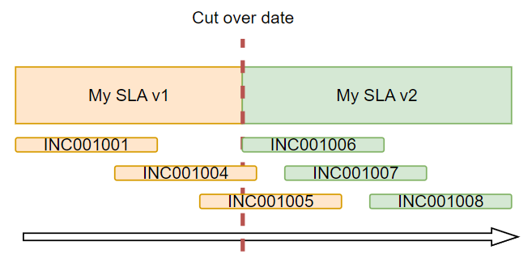](diagram-sla-cutover.png)

Example of the condition in the old SLA.

[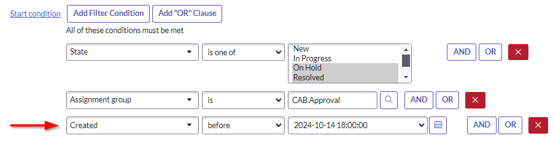](screenshot-condition-old.png)

Example of the condition in the new SLA.

[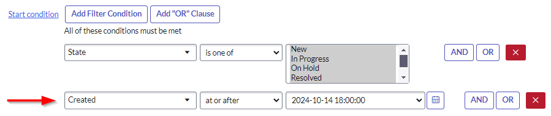](screenshot-condition-new.png)

**Don't forget** to update the cut-over timestamps in the start conditions at cut over / launch / release! When your SLA definitions go into production is when the cut-over should be.
If you did this straight into production, you don't need to worry about updating the conditions. However, I worry about you doing it in production…

## What else?
There are some other things that you should do if you're updating SLA definitions.

1. Communicate the change with affected users and stakeholders. Let them know that it's changing. E.g. modified durations, or modified conditions.

2. Again, communicate the change with affected users. They may have reports or filters that target specific SLAs which won't be accurate after a new SLA is introduced and the old one is decommissioned.

3. Decide what to do about old SLAs on old tickets. How long will you support the old SLA in measurements and reporting? What if an old incident has the old SLA but takes 3 months to close, will you still support it? It's OK to say 'no', but make that decision and write that down somewhere.

## What if I change it anyway?
[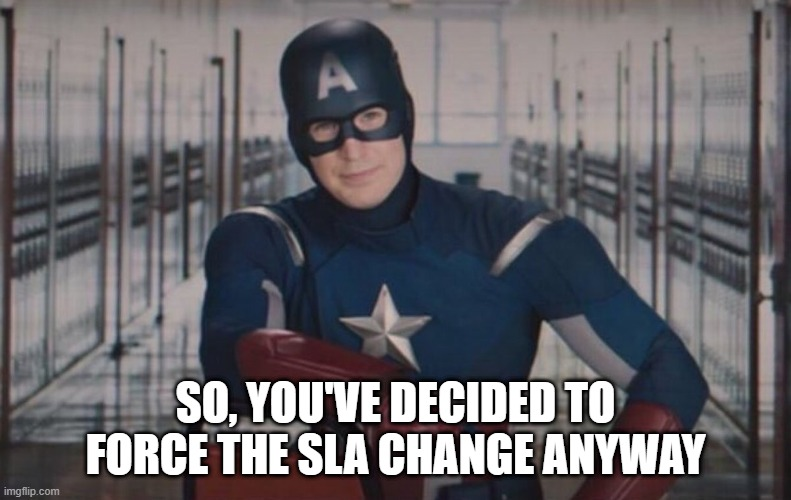](meme-captain-america-so-you-changed-it-anyway.jpg)

Let's talk about what happens if you do , and why you shouldn't have done that.

### Quirk: calculations and onDisplay
The "Elapsed time" and "Time left" fields on an SLA instance are calculated when the incident's form is opened. This is done by an onDisplay business rule "Calc SLAs on Display".

This means that those fields won't update until you look at the task it's attached to.

If you have any reports or dashboards that sort tasks and SLAs on their urgency, it's best to report or filter on the "Breach time" field instead of "Time left" fields.

[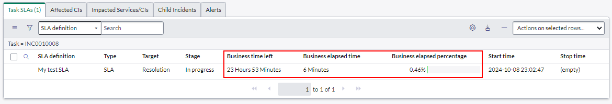](screenshot-ondisplay-related-list.png)

[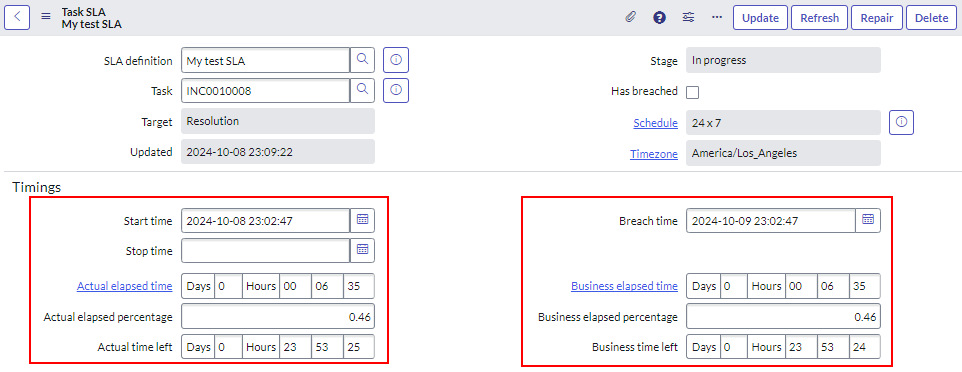](screenshot-ondisplay-form.png)

### Changing the name
This change is fairly safe and shouldn't break anything. It just changes the definition name as it appears in the SLA lists.

Before

[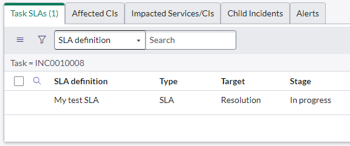](changed-name-before.png)

After the name was changed to "My test SLAAAAAAAAA".

[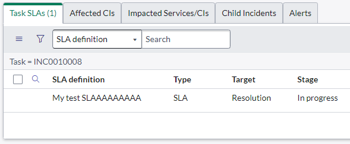](changed-name-after.png)

### Changing the duration
You shouldn't do this. Changes to the duration in the definition do not affect in-flight SLAs until someone or something looks at the task the SLA is attached to. Looking at the SLA does nothing.

Even then, the "Breach time" did not update itself no matter what.

Before

[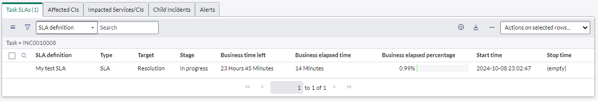](changed-duration-1-list.png)

[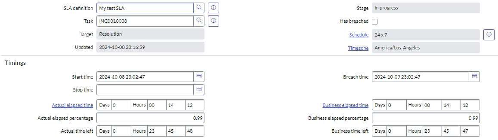](changed-duration-1-form.png)

After updating the duration from 1 day to 2 days. SLA end date in the future. 
The "Time left" fields didn't update until I opened the incident's form. 
The "Breach time" did not update when I changed the duration.

[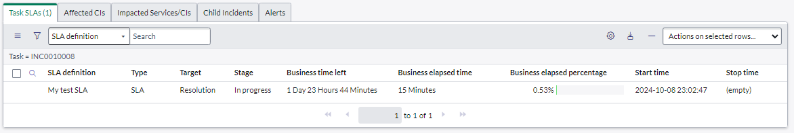](changed-duration-2-list.png)

After updating the duration from 2 days to 1 second. SLA end date in the past. I did not refresh the incident's form, SLA instance did not update itself. Stage is still "In progress".

Then I refreshed the incident's form. "Time left" fields show as well over the duration and "Has breached" is now TRUE. "Breach time" has still not updated to reflect the new duration.

[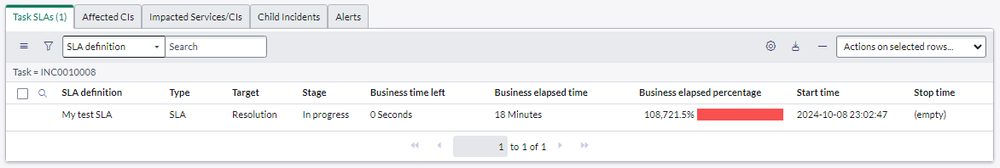](changed-duration-4-list.png)

[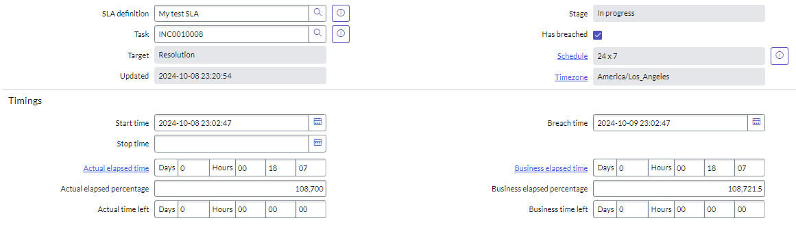](changed-duration-4-form.png)

### Changing the conditions
Changing the conditions won't take effect on in-flight SLAs until the task they're attached to is touched and the SLA engine runs. Recalculating the numbers / loading the task's page **does not** re-check the conditions.

Here's a test incident with the test SLA attached. 
Incident state: New
Start condition: Pause = On Hold, Resolved

[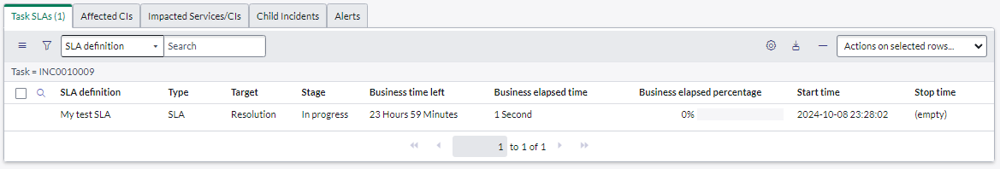](changed-condition-1-list.png)

[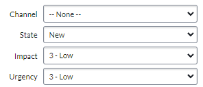](changed-condition-1-incident.png)

Changing the Start condition to include something that the incident doesn't have (Impact = 1).
No change to SLA. Start condition has already been met.
Made a change to the incident and saved. No change.

[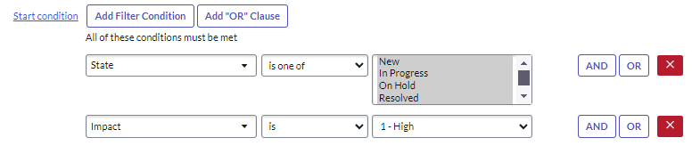](changed-condition-2-condition.png)

[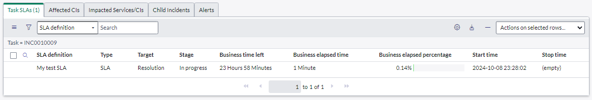](changed-condition-2-list.png)

Changing the Pause condition to include something the incident does have, adding the "New" state to the pause condition.
SLA remains unchanged. Stage is still "In progress".

[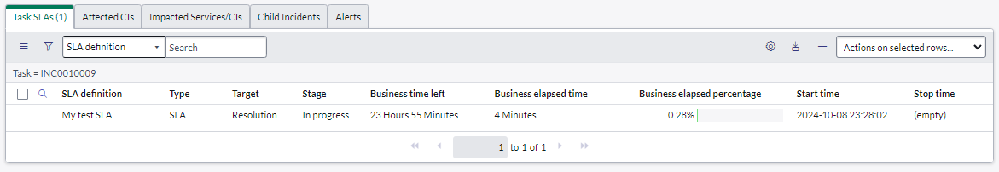](changed-condition-3-list.png)

Made a change to the incident and saved.
SLA is now paused. Relevant task needs to be "touched" before the SLA re-checks and conditions.

[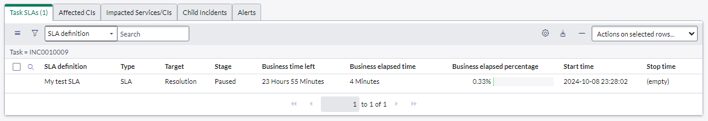](changed-condition-4-list.png)

### Changing Active / Inactive
This does nothing on in-flight SLAs. Disabling an SLA definition just prevents any new SLAs for this definition from starting.

For example here's an SLA Definition that is active with an SLA on an incident.

[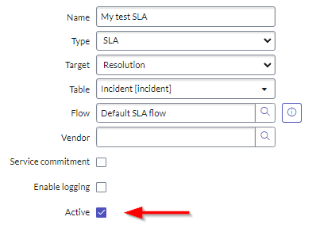](changed-active-1-sla.png)

[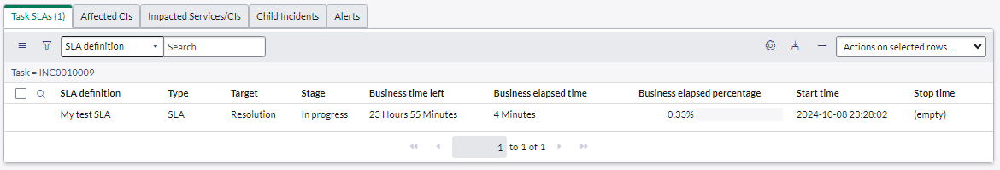](changed-active-1-list.png)

Updating the SLA Definition to be inactive. No change to in-flight SLA. Updated incident, still no change to in-flight SLA.

[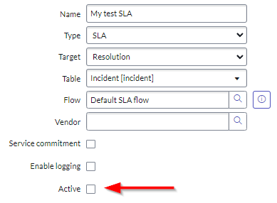](changed-active-2-sla.png)

[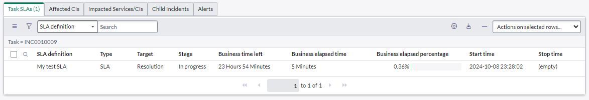](changed-active-2-list.png)

## Deleting the SLA definition
I did not test this. Give it a try and let me know what happens!

