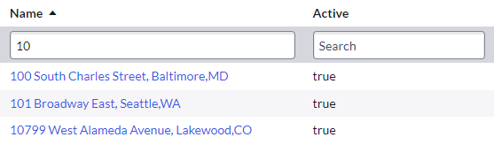

## The short answer
OK, so this article got longer than I expected. There was more to this than I first thought.

In short:
* Create an "Active" flag on the location table.
* Somehow hide inactive locations, suggestions below.
* Bonus point for making it pretty.

## Think about it first
What does a **'retired location'** mean? Spending some time to think about some of these questions can save you from a lot of **pain** in the future.

* Does 'retired' mean the location is marked or flagged in some way?

* Does 'retired' mean users can't search for the location or see it in lists?

* Does 'retired' mean users can't use the location in forms and catalog items? Are there exceptions where users might need to use retired locations? Would it cause issues if retired locations were completely off-limits without exception?

* What happens when another system integrates with ServiceNow involving a 'retired' location? User data feed and a user's location? Incident bonding and the affected location? ServiceNow Discovery and the schedule's "Location"?

* Are there more states than just 'retired' and 'not retired'? If so, you might need a "State" field with multiple choices.

* At what stage in a locations life is it marked as 'retired'? Is it when you leave the building? Is it when you've completely moved out?

* What sets a location is 'retired'? Is it a ServiceNow administrator doing data cleanup? Is it data coming from another system that decides if a location is retired or not? 

## Method 1 - Add "Active" field
Make a new field on the **Location** [cmn_location] table called **Active** [u_active] with the **type** of **True/False**. Set the **default value** to **true**.

Now you can flag retired locations with "Active = FALSE" and any existing locations will remain active.

[](screenshot-active-field-form.png)

### Bonus - Visible style for inactive locations
An optional customization to really make it obvious that a location is inactive is to create a **Field style**.

Create a new Style [sys_ui_style] by navigating to **System UI &gt; Field Styles".
**Table:** Location [cmn_location]
**Field name:** Name
**Value:** `javascript:if (current.u_active == true) {true;} else {false;}`
**Style:** background-color: red;

Feel free to change the `background-color` in the style to any colour you'd like. I like "tomato" because it's red-ish and hard to ignore, but isn't full red which burns into your eyes.

[](screenshot-style-list.png)

[](screenshot-style-form.png)

### Method 1.1 - Hiding inactive locations using filters
Now that you have an "Active" field, you can hide any inactive locations by updating filters and reference qualifiers on fields and variables.

This involves updating:
* any fields definitions [sys_dictionary] records where "Reference" = "Location".

[](screenshot-filter-dict.png)

* any related Dictionary Overrides [sys_dictionary_override] for location reference fields that override the reference qualifier (none by default).

[](screenshot-filter-dict-override.png)

* any catalog item variables [item_option_new] where "Reference" = "cmn_location"

[](screenshot-filter-variable.png)

For reports, users will need to be aware of the "Active" field and filter out inactive locations themselves. Otherwise, their reports will include both active and inactive locations.

**The good**
* Users can still see all locations (active or inactive) in their own lists and reports.
* Inactive locations can't be used in processes that shouldn't be using them (requests, incidents, assets, etc).
* Added flexibility of allowing the use of inactive locations where needed

**The bad**
* Tedious to implement, requires updating of almost all reference fields and variables.
* Can be difficult to update existing complex conditions to filter out inactive locations.
* All of the modified location fields means many skipped updates during an instance upgrade.

### Method 1.2 - Hiding inactive locations using a query business rule
Now that you have an "Active" field, you can use a **query business rule* to hide any inactive locations from everyone except your administrators.

In a nutshell, this business rule will sneaky add a condition to any query to the Location [cmn_location] table to exclude any locations where Active is not TRUE. Unless the user has one of the roles we want to be able to see inactive locations, then it won't add in that condition.

However, you only want to apply this filter if the user is querying something, you don't want to apply the rule if the user is looking directly at a record. That way, it's hidden from searches and lookups, but you can still click-through a reference field or use existing links to get to the inactive locations.

1. Create a new Business Rule. 
1. Call it something like "Location query" or "Location query hide inactive".
1. Set **Table** to "Location [cmn_location]"
1. Set **Advanced** to TRUE
1. Under the "Advanced" section, set **Condition** to `gs.isInteractive() && !gs.hasRole('user_admin')`. This is what prevents the restriction being applied when we don't want it to.
1. Set **Script** to the below. Tweak as needed, then **Save**.
```js
(function executeRule(current, previous /*null when async*/) {

    // Modify the query, add in the condition
    current.addQuery("u_active", true);

})(current, previous);
```

Now anyone with the **user_admin** (the role that can manage location data) role can see inactive locations, but anyone else cannot.

Admin can see inactive locations.

[](list-admin-can-see.png)

Non-admin cannot see inactive locations.

[](list-non-admin-cannot-see.png)

This applies to filters as well. Non-admins will not be able to select inactive locations when creating a new filter. In this example, "1007 Green Street Southeast" is inactive and cannot be selected by the non-admin user.

[](screenshot-cant-list-filter-on-inactive.png)

**The good**
* Easy to implement. Don't need to update every reference field to filter inactive locations.
* Queries on other tables that dot-walk to location data still work. This only affects queries against the **Location [cmn_location]** table directly. This means that users can still report and filter data depending on the related location. E.g. "I'm doing an audit on assets using retired locations, list all hardware assets where **Location.Active** is FALSE".

**The bad**
* Hides inactive locations without exception.
* Can't use inactive locations in catalog items. Normally this is good, but there's always a handful of cat items that need to use inactive locations.
* Hides inactive locations from record pickers when making a query.
* May interfere with data imports that don't have the 'required' role. If the data import user can't see existing data that is inactive, it may create duplicates because it thinks the location doesn't exist yet.

#### Method 1.2.2 - Hiding inactive locations using a query business rule, with an escape
This method is the same as above but addresses scenarios where you **want** to allow users to see inactive locations.

We're going to add in a little "magic" this time. There's always ***something*** that needs to allow users to select inactive records. Usually it's catalog requests involving assets that might be at an old locations. We're going to add an "escape" of sorts that won't restrict visibility if it's already trying to see inactive locations.

> You need to decide if this is something you want to allow. If the ability to see inactive locations is considered a security problem due do security restrictions, don't do this.

In a nutshell, it won't apply the filter if the filter already contains "Active is anything" (u_activeANYTHING). In other words, if the filter is already deliberately looking for both active and inactive locations.

Note that this will only work in lists and lookups. Users still won't be able to open the location's form, it'll be blocked by this query business rule.

Set the query business rule's script to the below, note the extra condition.

```js
(function executeRule(current, previous /*null when async*/) {

    // Check if the query is not already deliberately looking for inactive locations
    if (current.getEncodedQuery().indexOf("u_activeANYTHING") == -1) {
        // Modify the query, add in the condition
        current.addQuery("u_active", true);
    }

})(current, previous);
```

Non-admin cannot normally see inactive locations.

[](query-escape-without.png)

Non-admin can see inactive locations if the filter explicitly asks for it.

[](query-escape-with.png)

## Method 2 - Rename the location "(RETIRED)"
This approach is simple and straight-forward, just add a suffix like "(RETIRED)" and the end of the name of any location you want to retire. Easy peasy lemon squeezy.

[](screenshot-suffix.png)

**The good**
* No customization required.
* Easy for users to see if the location is retired, just look at the name (most of the time, see the bad).

**The bad**
* Not always clear for the user to see if the location is retired. Lists will truncate the name to 40 chars, making the "(RETIRED)" at the end invisible unless the user hovers their mouse over it.
[](screenshot-suffix-truncated.png)
* No clear filter for users to use to filter out retired locations.
* Identifying retired locations is "fuzzy". Have to search the name (where Name contains "retired"), which may give false-positives if the name legitimately contains the phrase (e.g. "Queensland Retired Teachers' Association").
* May be an issue with very long location names that cannot fit "(RETIRED)" due to size limit of the name field (default 100 chars). What do you do? Do you make the location name shorter to fit? Do you truncate the suffix to "(RETI" as much can fit?

## Method 3 - Just delete it
Don't do this.

[](meme-eggman-pushing-delete.png)

**The good**
* No customisation required.
* Very fast to implement.
* Reduces need to maintain historical data.

**The bad**
* Any existing data (incident, requests, users, assets, etc) will lose any reference to that location. You'll break existing data.
* Any filters or reports using that location will behave unexpectedly.
* Risk of any data feed integrations automatically re-creating the location after it is deleted.

## Links
* SN Community - Disabling a Location
 https://www.servicenow.com/community/developer-forum/disabling-a-location/m-p/1504549
* SN Community - Make location inactive?
https://www.servicenow.com/community/itsm-forum/make-location-inactive/td-p/467851
* SN Community - what should I do to "retire" a location in the Servicenow?
 https://www.servicenow.com/community/cmdb-forum/what-should-i-do-to-quot-retire-quot-a-location-in-the/m-p/2873985