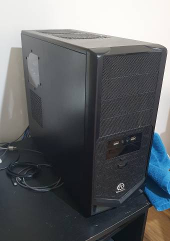
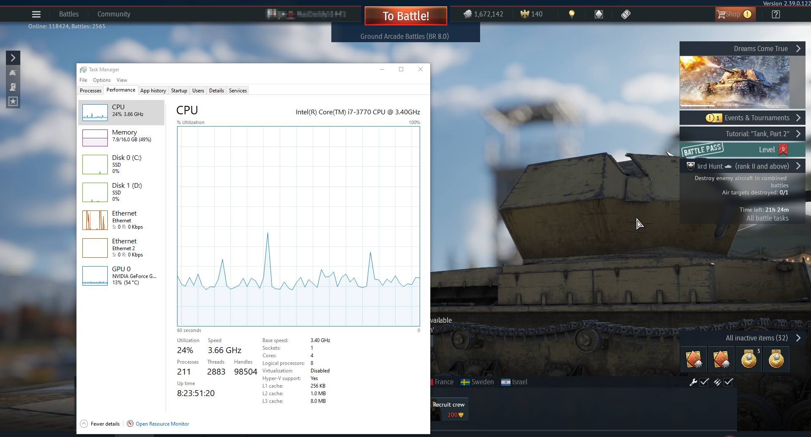
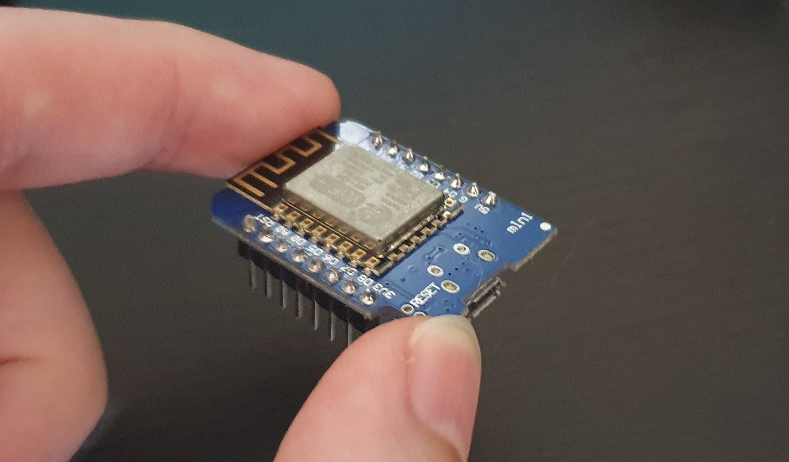
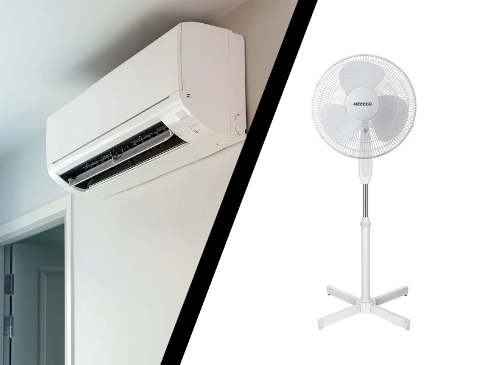
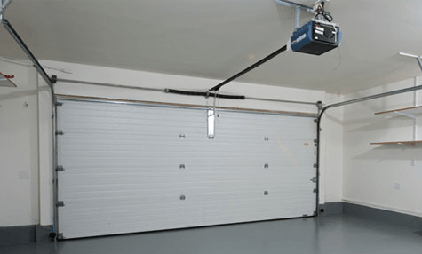

## The math
I keep forgetting the math for this one, so I'm going to write this down.

### Power
Almost all power companies will charge you per kilowatt-hour (kWh). To calculate Kwh:
**kWh = w x hrs it was running**

To calculate the cost your power company will charge you for power usage:
**$ Cost = kWh x cost per kWh**

or 
**$ Cost= ((W / 1,000) x hrs) x cost per kWH**

Here's an explaination for those units.

A **Watt (W) = voltage x amps**
*E.g. 5 volts x 2 amps = 10 Watts

A **Kilowatt = Watts / 1,000**

**Watt-hours (Wh) = watts x hrs**

Kilowatt-hours (kWh) = Wh / 1,000**

> For the nerds in the room:
> **Current (Amps) = 1 columb (lots of moving electrons) per second**
> But that's not important right now...

### Number of hours
1 week = 168 hours

1 year = 8,760 hours

## Measuring power consumption
My energy provider charges me about $0.25806 per kWh.

### My computer

My computer isn't fancy.
* Intel i7-3770 @ 3.40 GHz CPU
* NVIDIA GeForce GTX 100 graphics card
* ASUSTeK INC. P8Z68-M PRO motherboard
* 2x solid-state drives

When my PC is idle it consumes about 50-90W. Lets average that out to 90W.

If I ran my computer for a year, idle for the entire time, it would cost me 
~70 W = ~0.070 kW
~0.070 kW x 8,760 hrs = 613.2 kWh
$0.25806 x 613.2 kWh = **$158.24 / year = $39.56 / quarter**

Damn, that's more than I thought, and that's only if it's idle.

Assuming I use it for work hours (8 hrs a day) on work days (about 200 out of 365 days a year) and I'm not doing anything taxing or intense.
200 d / 365 d = 54.79% days of the year
8 hrs / 24 hrs = 33.33% hrs of the day
$158.24 x 54.79% days x 33.33% hours = **$28.90 a year**

OK, that's a big more reasonable if I'm only running it for a few hours a day.

If I have the game War Thunder running in-game, my PC uses about 200W.

What if I ran it 24 x 7 for a year?
0.200 kW x 8,760 hrs = 6,132 kWh x $0.25806 = **$1,582.42 a year**

Hot damn, that's expensive! Good to know, don't leave resource hungry games running on your computer 24 x 7 for a year!

What if I only had it running for 8 hrs a day, every week day like the obsessed teenager I was?
(365 d / 7 days in a week) x 5 days a week = 71.43% days of the year
8 hrs / 24 hrs = 33.33% hrs of the day
$1,582.42 x 71.43% days x 33.33% hours = **$376.74 a year**

No wonder the power bill was so high when I was a kid spending most of his time on the PC.

### Microcontrollers (ESP8266)
What about a little wifi microcontroller, the ESP8266? These are used most Wifi IoT devices these days, including:
* smart light bulbs
* wifi power sockets
* wifi cat feeders

An ESP8266 dev board (Wemos D1 mini) has an average power consumptions of about 100 mA if it never goes to sleep. No voltage regulator is perfect, let's assume it's only 50% effecient, so 100 mA becomes 150 mA consumption @ 3.3 V.

0.15 A x 3.3 V = 0.495 W = 0.000495 kW x 8,760 hrs = 4.3362 kWh a year
$0.25806 x 4.3362 kWh = **$1.12 / year or $0.28 / quarter**

That's pretty reasonable, a swarm of those around the house wouldn't hurt the power bill much at all.

### Fan vs Air-Conditioner

> "It's cheaper to run an air-conditioner 24/7 than it is to run a fan 24/7"
> *- dubious advice from a friend*

A friend once told me that, and I've always been sceptical. It felt like an excuse to use the air-conditioner all the time. I always wanted to sit down and do the math to prove them right or wrong.

My pedestal fan on 3 (max) uses about 37 W. It uses a bit more when it starts, but it settles after about 10 seconds.
0.037 kW x 8,760 = 324.12 kWh a year x $0.25806 = **$83.64 a year of constant use**

The power consumption of an air conditioner is tricky. It can be affected by:
* How they stop and start depending how cold the room it's trying to cool is
* The size and strength of the aircon unit.
* How well maintained it is (impacted by air leaks, open doors & windows, clogged vanes, low coolant, etc)

According to [choice.com.au](https://www.choice.com.au/home-and-living/cooling/air-conditioners/articles/air-conditioner-energy-usage-and-running-costs), here's what the average power consumption is for air conditioners.

| Portable | Small split | Medium split | Large split |
| --- | --- | --- | --- |
| Size | 2–5.5kW | Up to 4kW | 4–6kW | Over 6kW |
| Average power consumed in one hour | 1.2kW | 0.65kW | 1.36kW | 2.15kW |
| Range of power consumed | 0.46–2.2kW | **0.31–0.94kW** | 0.53–1.85kW | 1.52–3.19kW |
| Average running cost | $173 | $82 | $164 | $264 |
| Range of running costs | $66–317 | $50–134 | $126–240 | $164–390 |
| Average price | $728 | $1438 | $2139 | $2807 |

If I had a medium split cooling the living room for 24/7:
0.31–0.94kW = average 0.625 kW x 8,760 hrs = 5,475 kWh a year x $0.25806 = **$1,412.8785 a year**

**$1,412.88 a year costs a lot more than $83.64 a year.** 

Sorry that friend of mine, but you are wrong, very wrong.

### Garage door
What about an automatic garage door? It's plugged in constantly, does it draw much power?

Idle, it consumes about about **1.6 W**.
0.0016 kWh x 8,760 = 14.016 kWh year x $0.25806 = **$3.61696896 a year**
Not bad, that's just keeping the thing on all year.

When moving up and down, it uses about **390 W** for about **15 seconds**.
390 W / 15 seconds = 26 Watt seconds x 30 sec to open and close = **52 Watt seconds**
52 Watt seconds / 60 secs in a min / 60 mins in an hr = **0.014 Wh to open and close**

If I drove into work every work day and opened & closed the garage twice (leaving and coming home), and there's about 200 work days in a year.
2 times a day x 0.014 Wh per cycle x 200 days = 5.6 kWh a year x $0.25806 = **$1.25806 a year**

Wow, that costs a lot less than I thought! When I saw the 390W consumtion when it was moving, I thought it would cost a lot more, but only consuming that much power for 15 seconds makes a huge difference.

## Thoughts on Solar Power
I have a 5 kW solar system at my house, which would negate some of the above costs.

Assuming that it provides enough power from 6am to 6pm (half a day) and produces power for 80% of the days in the year, it'd remove the yearly power costs by **40%**.

Although, you'd want to compare that to the cost of the solar system if you're paying it off. This gives weight to solar systems
* Save you more if you use more power during the day.
* Are less useful if your solar panels are overkill for your house's average power consumption.

## What's next?
This was a fun article to write! Let me know if you have any suggestions for other electronics to calculate the cost.

If I get the chance, it'd be cool to measure the cost to power things like:
* an electric oven
* a fridge
* charging a phone