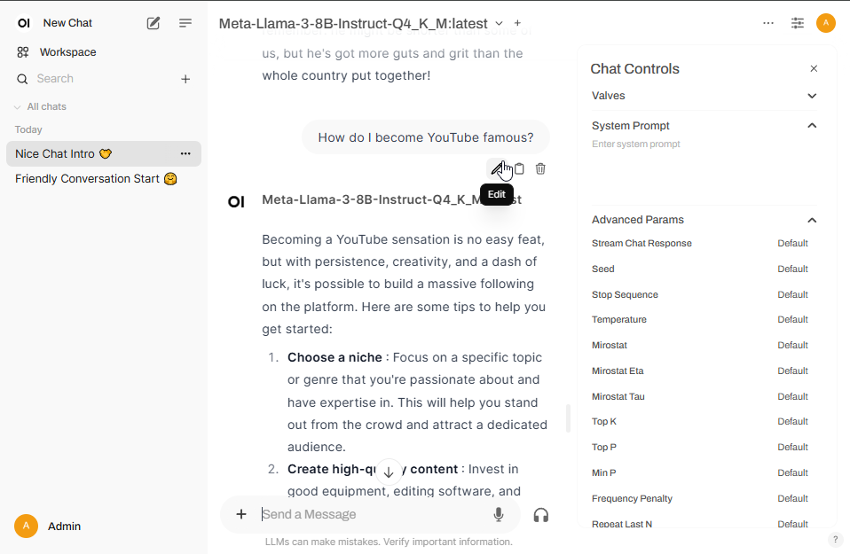

## Overview
Let's host our own generative AI LLM on our own machine. This guide will focus on running your own personal GenAI, most of this guide applies to business use-cases as well.

We'll be using **Ollama** as our backend and brain of the AI, and **Open WebUI** as the front-facing UI that humans will use to talk to the AI.

Why host your own personal AI?
* If you use the AI a lot, it's cheaper to host your own vs paying for ChatGPT or Azure OpenAI.
* Everything stays in your control and on your machines vs sending your data to who-knows-where in the cloud.
* You can use any LLM you want to, even the spicy **uncensored** ones.

But above all else…

[](because-its-cool.png)

## Terms and acronyms ahead
There are some generative AI terms and acronyms that you might want to know before diving in. We're going to be using them in this guide.

* **GenAI**
 Short-hand for **Generative AI**.

* **Model**
 Programs or structures that detect patterns in data to draw conclusions.

* **LLM** or **Large Language Model**
 It's the brain of generative AI that has been trained by someone and can be swapped in-and-out for different results. It's just a really big model. Some are better, some are worse, some have specialties (e.g. generating code), some are more compact for low-power machines. There's a great variety of LLM's these days.

* **Inference**
 Pushing data through a trained AI model, and getting a result. For Generative AI, it basically means using it. You'll see terms like "CPU inference" (running your model on your CPU instead of a GPU), that's what it means.

* **Hallucination**
 When the AI gets asked something, but the answer it generates is not quite right or absolutely wrong. Some LLMs hallucinate a lot more than others.

* **Censored / Uncensored models**
 Most LLMs are censored to prevent them from talking about forbidden topics. Remember when everyone tricked ChatGPT to teach them how to make napalm or heroine? Yea, that's censored now. There are uncensored LLMs if you really want to run one.

There's many more, you can read more here: [The Generative AI Glossary for Business Leaders](https://www.salesforce.com/artificial-intelligence/generative-ai-glossary/)

## Step 1 - Installing Ollama
Enough talk, let's get started!

[](ollama-logo.png)

[Ollama](https://ollama.com/) is going to be our backend that will run our GenAI LLM. It's the main engine of this setup.

1. Download and install Ollama.
 https://ollama.com/download

Ollama should now be running in the background. You can see it in your task bar.

[](ollama-in-taskbar.png)

We can't do much with Ollama right out of the box. We need to give it:
* a brain.
* a way for us to talk to it.

## Step 2 - Install an LLM
Ollama doesn't come with an LLM (the brain), we need to give it one.

You can install LLMs:
* of a variety of types
* of a variety of formats
* from a variety of sources

To keep things simple, let's use Ollama (the program) to fetch the Llama LLM from the Ollama website. Llama is an LLM trained by Meta and is well trained and very powerful.

[](llama-logo.jpg)

1. Open https://ollama.com/search
1. Search for "llama".
1. Click on the latest version of Llama (at current: llama3). You can either go with **llama3.2** which is 1b or 3b and works on smaller machines, or go with **llama3.1** which is 8b, 70b, and 405b for more powerful machines.
 **Try the 8b version. If you find it slow or doesn't work right, switch to the 1b, 3b version.**
 
 [](ollama-llm-browser.png)

1. Find the command to add the model and copy it. 
 E.g. `ollama run llama3.2:3b`
1. Open a command prompt and run the command coped earlier. This will tell Ollama to go fetch and install the model.
 [](screenshot-download-an-llm.png)
1. After installing the LLM, Ollama will enter a conversation prompt. Try talking to the new model to see if it works.
1. When you're done talking with the new model, press Ctrl+D or type "/bye" and press Enter to exit the Ollama prompt.

## Step 3 - Install a GUI (Open WebUI)
Let's give our GenAI a cool web-based interface so we can talk with our AI in a web browser. We'll use [Open WebUI](https://openwebui.com/).

[](open-webui-screenshot.png)

### Why can't we use Ollama directly?
* Ollama only talks through web APIs and the command line, which isn't very human-friendly.
* Ollama has no authentication or authorisation functionality, and will trust anything you throw directly at it, even if it's bad or breaks stuff.
* Ollama is like a database: you shouldn't allow direct access to your database, only use it behind something else.

That's why we'll want to use something like Open WebUI to talk to our AI.

It's got loads of extra features too:
* It has user-based access so you can control who can use it and what powers they have.
* It can store your reference data as "Knowledge Collections" for using and re-using, instead of using once and then forgetting.
* It can enable the LLM to search the web or search other systems for data as part of generating a response.
* It can use "Actions" to automate activities with your LLM, like a button macro in Excel.
* It can use "Tools" to allow your LLM to query or make changes to remote systems.

### Install via Docker
It's a lot easier to install Open WebUI using Docker. This works great for Linux, but if you're on Windows I'd recommend using the **Python pip** method.

You can read more here: [Open WebUI Quick Start](https://docs.openwebui.com/getting-started/quick-start/)

Docker container with Ollama running on the same machine.
```
docker run -d -p 127.0.0.1:3000:8080 -v open-webui:/app/backend/data --name open-webui --restart always ghcr.io/open-webui/open-webui:main
```

Docker container with Ollama on a different machine.
```
docker run -d -p 3000:8080 -e OLLAMA_BASE_URL=https://your.ollama.goes.here -v open-webui:/app/backend/data --name open-webui --restart always ghcr.io/open-webui/open-webui:main
```

Once the docker container has started, you can access Open WebUI on http://localhost:3000

### Install via Python pip
We can install Open WebUI using the Python package manager **pip**. This fetches everything it needs and adds **open-webui** as a Python module we can run directly.

Note: The install can be large, and Python will want to install it where Python lives. Make sure that the disk where Python is installed has a few GB free.

1. Make sure you have Python 3.11 installed to avoid compatibility issues.
1. Open the command prompt.
1. To install Open WebUI, run the command `pip install open-webui`
 If you have multiple version of Python installed, call Python 3.11 directly.
 `C:\Python311\python.exe -m pip install open-webui`

Once it's installed, you can start Open WebUI with this command.
`open-webui serve`
or
`C:\Python311\python.exe C:\Python311\Scripts\open-webui.exe serve`

If Ollama is running on a different machine, you can configure it using environment variables.


[](openwebui-running.png)

Once it's installed and running, you can access Open WebUI on `http://localhost:8080`.

### 1st time setup
When you log into Open WebUI for the first time, it'll ask you for a name, username, and password. This user will become the admin user, so don't forget the username and password!

[](openwebui-create-admin.png)

[](openwebui-landing-page.png)

If you forget the admin username and password, follow these instructions: 
https://docs.openwebui.com/troubleshooting/password-reset

## Start chatting
1. Open the Open WebUI page. If you just loaded a new LLM, you may need to refresh the page.
1. Select a model in the top-left of the page.
 [](openwebui-select-model.png)
1. Start chatting with it.
 [](chatting-example.png)

Congratulations! If your goal is to host an AI on the same computer you'll access it from, you can stop here. 

Here's a video of me chatting on a computer. Watch the performance graphs, you can see the ~20 sec delay as the model is loaded when the chat first starts, then there's hardly any delay at all. *The AI thinks I'm cool.*

<div style="border: solid 1px black; max-width: fit-content;">
<video controls>
    <source src="chatting-on-my-pc.mp4">
</video>
</div>

Here's a video of me chatting from my phone. I stopped the AI during a really long response and asked it to give me the short answer, which it did, which is cool.

<div style="border: solid 1px black; max-width: 50%;" >
<video controls>
    <source src="chatting-on-my-phone.mp4">
</video>
</div>

## Accessing your AI from the internet
My goal here is to be able to host my own AI at home and access it while I'm away from home on my laptop or my mobile phone.

My options are:
* Expose Open WebUI to the internet
* Use a VPN to my home internet, and access Open WebUI directly

[](diagram-access-my-ai.png)

**In my case, I already have a VPN into my home network, so I'm already set.**

If I wanted to expose Open WebUI to the internet, I wouldn't do it without tightening security. I'd recommend using:
* a reverse proxy (e.g. [Nginx Proxy Manager](https://nginxproxymanager.com/)).
* HTTPS with your own security certificate (e.g. [Let's Encrypt](https://letsencrypt.org/)).
* a (dynamic) host name for your network (e.g. [no-ip](https://www.noip.com/) or [duckdns](https://www.duckdns.org/)).
* a non-standard port number (don't use ports 80, 8080, 443, or 8443, use something higher than 2000)
* using very secure passwords

Here's a guide for hosting Open WebUI behind a plain nginx reverse proxy server:
https://docs.openwebui.com/tutorials/integrations/https-nginx 

## What's next?
There is so much you can do with your own personal LLM! I'll write another blog post where I'll talk about a few of them. Here's a few to wet your appetite until I do.

### Ask it questions
[](chat-ask-trivia-question.png)

### Ask it to write stories, gift card messages, or emails
[](chat-writes-a-story.png)

### Ask it to write code for you
[](chat-writes-code.png)

### Asking it to read and summarize a document (e.g. a really big contract).
[](chat-reading-a-web-page-for-me.png)

### Make your friends laugh with an AI written summary of them (works most of the time)
[](chat-funny-description.png)