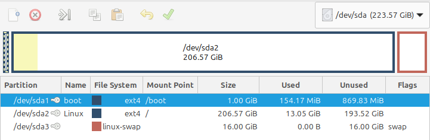

## The background
I'm going to try moving my main PC from Windows 10 to Linux.

I've been using Linux on my home server for years, but I haven't made the leap from Windows to Linux on my main PC.

### But why?
I don't want to upgrade to Windows 11, but Microsoft is ending support for Windows 10. I keep hearing bad things about Windows 11.
* Reports of spyware baked-into the OS that's hard to remove.
* Advertisements in search results.
* Task bar is a rip-off of the Mac OS start bar. If I wanted a Mac, I'd use a Mac.
* AI watching everything you do.

I do some dev work with Docker, but my PC doesn't run Docker easily. I've had to try loads of tricks to get it working, but I'd rather it "just worked".

Finally, I've always wanted to give it a try.

## The plan
A lot of people recommend [Linux Mint](https://linuxmint.com/) as the Linux distribution to use for a PC, so I'm going to use that.

I'm going to install it on a separate hard drive and keep my Windows hard drive plugged in if I ever need to switch.

Partition layout for the Linux drive.

Partition layout for the Windows drive.

Partition layout for the "data" drive (everything else goes in here).

## Planning for changes
I don't want to dive into Linux without thinking and get burnt out in a week. Let's think about what I use Windows for, and what's available in Linux that's similar.

### Image editor
Status: challenging

I use [Paint.NET](www.getpaint.net) to do things like:
* Cut people out of images to use in memes.
* Creating thumbnails and memes for my tech blog.

Sadly, there's no Linux version and it can't be run in Wine (Windows emulator).

[Gimp](https://www.gimp.org/) is an image editor that runs natively on Linux. However, it's a bit more complicated to use than Paint.NET.

I tried [Krita](https://krita.org/) which is another Linux-native image editor. I didn't like that you can't move the selection box so your selection must be perfect on the 1st try.

I tried [Pinta](https://www.pinta-project.com/) which is another Linux-native image editor. It was not good, it had stretched icons, overly simple UI, not an alternative to Paint.NET.

I might have to explore different options, or do a separate article on finding an alternative to Paint.NET.

### Office (MS Word, Excel, PowerPoint)
Status: challenging

I use MS Office for work. Ideally, I'd like to keep using MS Office instead of an alternative.

Sadly, there is no native Linux version, and getting MS Office to run on Linux is difficult.

* Could emulate the Windows version through Wine. However, I hear that it doesn't work great.
* Could run a Windows virtual machine on Linux and install & run Office inside of it. I'm not sure how that works for licensing Windows 10 within a virtual machine.
* Could use the web versions, but they are missing features, and are slower.
* Could use Google Docs, but then I'd need to move everything to Google Drive and I don't want to do that.

There are some Linux alternatives like [OpenOffice](https://www.openoffice.org/) and [LibreOffice](https://www.libreoffice.org/), but they might be missing some features which I use.
* No smart art.
* No icon library.
* No "Smart Art".
* Looks a little clunky.

I might need to examine this topic further to find a solution.

### MS OneNote
Status: challenging

I use Microsoft OneNote for almost all of my note taking and writing. Heck, I'm writing this blog article in OneNote right now.

Similar to the rest of Microsoft Office, there is no native Linux versions, and the online version isn't as good as the desktop version.

Someone has written an Electron wrapper to allow the web version to be run as a desktop app on Linux. This has most of the benefits of running as a desktop application. This might be a decent alternative.
https://github.com/patrikx3/onenote

There are alternatives to OneNote, but I already have everything in OneNote and would prefer not to move to a different platform or solution.

### Diagramming with Draw.io
Status: good

I use [Draw.io](https://www.drawio.com/) to draw diagrams. I really like Draw.io and I'd be very unhappy if I couldn't continue to use it.

There is an online web version, but I'd prefer to keep using the desktop version.

There is a native Linux version, no issues there.

### GreenShot screen grabber
Status: good (maybe)

I use Greenshot to take screenshots in Windows. I really like:
* capturing a region by clicking and dragging.
* quick feature for capturing to clipboard or saving to file.
* quick image editor to add arrows, boxes, highlighting, or obfuscating. Incredibly useful.

Some options are explored in this discussion:
[Reddit - Linux alternative for greenshot](https://www.reddit.com/r/linux4noobs/comments/18w7a8/linux_alternative_for_greenshot/)

There are some alternatives for me to explore, I'll have to dive in and try them.
* [Shutter](http://shutter-project.org/)
* [Flameshot](https://flameshot.org/)

### Games
Status: good

Playing games on Linux has often been a challenge preventing many from switching.

A lot of this has changed since [Steam](https://store.steampowered.com/) released the Steam Deck (a Linux-based hand-held gaming computer) and released [Proton](https://www.protondb.com/) which allows non-Linux games to play on Linux. At current, most Windows games are able to be played on Linux, but there might be some tweaking to get there.

Here's some games that are at the front of my mind:
* X4. Works natively in Proton.
* Starsector. Linux native.
* War Thunder. Linux native, some say it works great, some report issues. 
* Subnautica. Works in Proton with some tweaks.
* Metal Gear Rising. Works in proton natively.
* Doom Eternal. Works in Proton with some tweaks, but not perfect.
* Helldivers 2. Works in Proton with some tweaks, but not perfect.
* Railgrade. Works in Proton without issues.
* Rimworld. Works in proton native.
* Stardew Valley. Works in proton, appears to have no issues.
* Stellaris. Works in proton, but not perfect. Visual bugs.
* Timberborn. Works in Proton with some tweaks around CPU settings.
* Satisfactory. Proton, mixed results, some work without changes, some have graphic bugs, some don't can't run it at all. Apparently works best installed on a Linux volume instead of from a Windows NTFS volume, good to know.

### Web Development
Status: good

I do some NodeJS and React web development as a hobby.

VS Code and NodeJS have native Linux versions. Heck, it would probably run faster in Linux than Windows.

### AI and ML development
Status: good

I've been playing around with some generative AI and machine learning projects for fun on Windows which uses Python and Nvidia CUDA most of the time.

There are native Linux version of each of those, no issues there.

### Arduino and Hobby Electronics
Status: good

I use VS Code and Platform.io to program microcontrollers like Arduino boards and ESP8266 boards for some hobby electronics.

VS Code has a Linux version, and Platform.IO is Python-based which runs on Linux natively, no issues there.

I use [Fritzing](https://fritzing.org/) to diagram and design electronics. It has a native Linux version, no issues there.

### VNC
Status: good

I use VNC to remote-desktop to some computers around my house.

Looks like TightVNC has native Linux version of both the server and the client. Nice!

I've been using [x11vnc](https://github.com/LibVNC/x11vnc) as a VNC server for years now, I can stick with that. There's even a newer version hosted under [LibVNC](https://github.com/LibVNC/libvncserver), I might give it a try.

### Putty
Status: good

I use [Putty](www.putty.org) as an SSH client to talk to my home server.

Linux has a native client `ssh`, I'll just use that.

## What's next?
I think I'm ready to get into it. I might like it, I might become a professional alcoholic. Wish me luck!