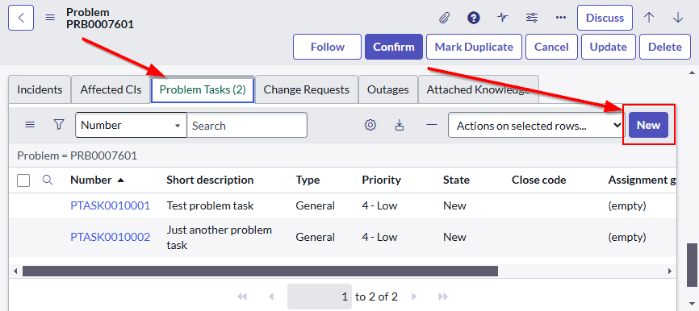
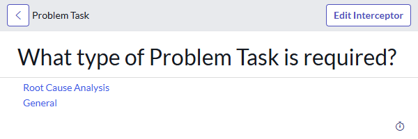
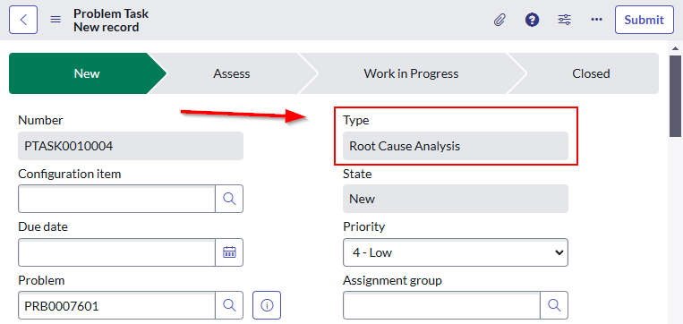
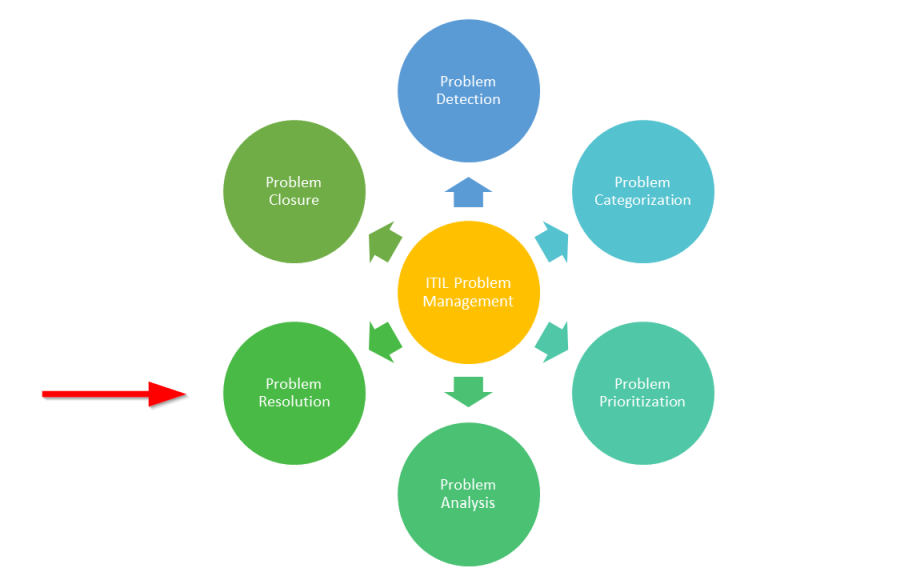
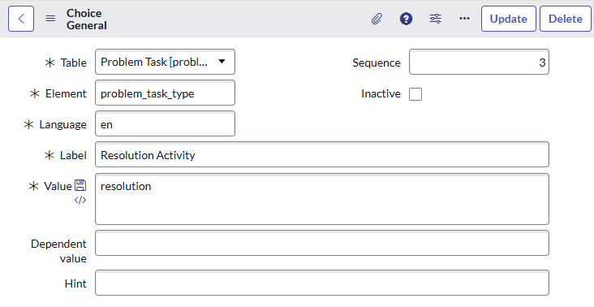
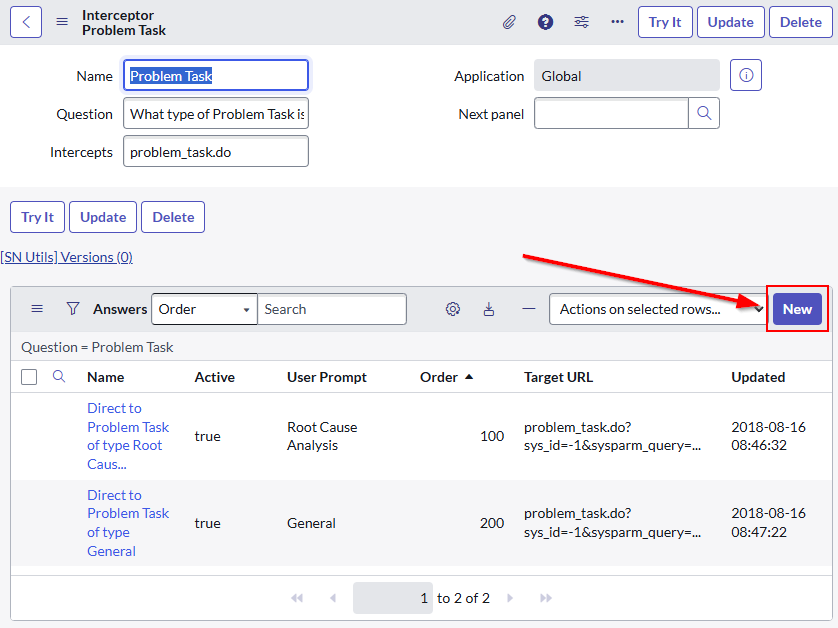
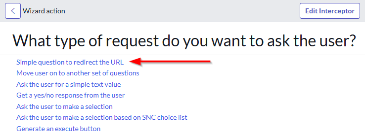
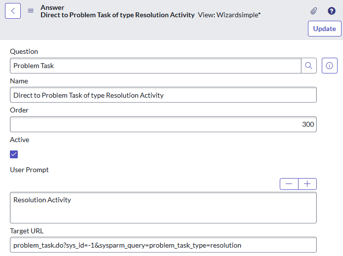
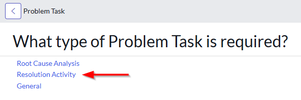
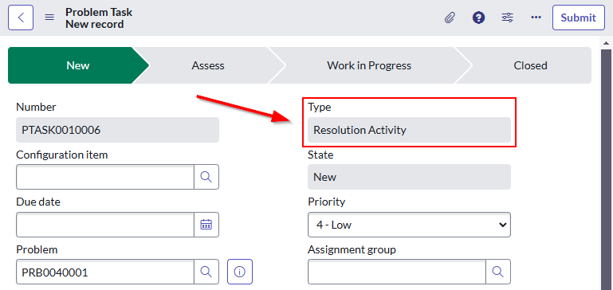

## The challenge
When you create a new Problem Task in ServiceNow, there are 2 problem task types to choose from:
* General
* Root Cause Analysis

This automatically set's the "Problem task type" field of the new task, and cannot be changed later.

**What if you want more options?**

In ITIL v4, there are other steps to the Problem Management lifecycle, including "**Problem resolution**" where actions are taken to prevent the problem from happening in the future. There's no specific problem task type for this.

Sadly, there's no ServiceNow magic to do this for you, but the process is fairly simple to add more problem task types.

## Creating the new task type
Here's how to create a new Problem Task Type.

In this guide, we'll create the new problem task type of "Resolution Activity".

1. Create a new Problem task type as a **"Choice" [sys_choice]** for the **"Problem Task.Type"** field.
**Table:** Problem Task [problem_task]
**Element:** problem_task_type
**Value:** (short name of new task type)
**Label:** (name of new task type)
**Language:** en (or as required)
**Sequence:** (as required, can be re-ordered later)

2. Update the interceptor to add a new option for the new problem task type.

Interceptor to update: https://yourinstancehere.service-now.com/sys_wizard.do?sys_id=29f12894534823004247ddeeff7b1222

When you try to create a new answer, it will ask you what kind. Click on **"Simple question to redirect the URL"**.

Set up the new wizard answer for the new problem task type. Make it similar to the other options in the wizard.
**Question:** Problem Task
**Name:** Direct to Problem Task of type *(type name)*
**Order:** As required, can be reordered later
**User Prompt:** *(name of new type)*
**Target URL:** problem_task.do?sys_id=-1&sysparm_query=problem_task_type=*(short name of new task type)*

**Congratulations!** You've now created your own **Problem task type**! Give it a try by creating a new problem task from a problem, you should be able to see the new problem task type in the interceptor and in the "Type" field on the new problem task.

## What about Problem Task Models?
Oddly enough, functionality has been added to Problem Tasks to support Task Models based on the Problem Task Type, however:
* I couldn't find any instructions on ServiceNow Docs to support using Task Models on Problem Task Types.
* I wasn't forced or coerced by ServiceNow to use task type models.
* There's an alternative interceptor wizard for "Problem task models" which prompted the user to select a Problem Task Model [prb_task_model] for the new problem task, but I couldn't see that it was being used.

I suspect this is only useful if you wanted your Problem Task Type to have its own **state model** that works differently from the out-of-the-box Problem Task states.

Something to think about if you really need this feature.

## Links
* Purple Griffon - ITILv4 Problem Management
 https://purplegriffon.com/blog/itil-problem-management
* SN Community - Creating a new problem task type
 https://www.servicenow.com/community/sysadmin-forum/creating-a-new-problem-task-type/m-p/2721465
* SN Community - Add new Problem Task Types
 https://www.servicenow.com/community/developer-forum/add-new-problem-task-types/m-p/2670104
