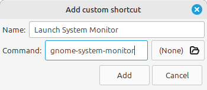

## Cmd key vs Win key vs Super key
It's all the same thing, some people call it:
* "the super key"
* "the windows key"
* "the command key"

## Summary
| Hotkey                                                   | Decision                          |
|----------------------------------------------------------|-----------------------------------|
| **Cmd+L** to lock the machine                                | Different but easy change.        |
| **Cmd+E** to open file explorer                              | Works just like Windows.          |
| **Cmd+Up/Down/Left/Right** to move windows around the screen | Works (mostly) just like Windows. |
| **Cmd+R** to get the run dialog                              | Different but easy change.        |
| **Ctrl+Shift+Esc** to open the task manager                  | Different but easy change.        |
| **Cmd+P** to switch multiple monitor modes                   | Meant to work, but sorta doesn't. |
| **Ctrl+Alt+Delete** to get to task manager                   | Different, but didn't change.     |
| **Ctrl+Shift+N** to create a new folder                      | Works just like Windows.          |

## Hotkeys
### Cmd+L to lock the machine
In Windows, **Cmd+L** locks the machine. 

Out of the box, **Cmd+L** opens Milange (the Cinnamon debugger). 

Out of the box in Linux Mint "**Lock screen**" is **Cmd+Alt+L**.

I changed the hostkeys to be more like Windows:
* **System > Lock screen** from "Cmd+Alt+L" to "Cmd+L". 
* **Troubleshooting > Toggle Looking Glass** from "Cmd+L" to "Cmd+Alt+L" or something else. 

### Cmd+E to open file explorer
Works! In Linux Mint Cmd+E opens the file explorer, just like Windows. 

 
### Cmd+Up/Down/Left/Right to move windows around the screen
Works! In Linux Mint, Cmd+Up/Down/Left/Right moves windows around the screen similar to how Windows does. 

**However:** it won't move windows across screens, it will stay on the same screen. 

You can move windows across monitors, add "Shift" to the hotkey.
**Cmd+Shift+Up/Down/Left/Right** 

### Cmd+R to get the run dialog
In Windows, this opens the Run dialog where you can quickly run a command or open a location by typing it in. 

E.g. "calc" runs the calculator. 
E.g. "%appdata%\Microsoft" opens the folder "C:\Users\myuser\AppData\Microsoft" in Explorer. 
E.g. "\\server\share" opens a file share in Explorer. 

In Linux Mint, Cmd+R doesn't do anything.

There's a run dialog you can open by pressing "**Alt+F2**".

I like using "**Cmd+R**", so I changed the hotkey.

**Sadly**, while you can use this Linux run dialog to open folders on the computer, it can't be use to open remote locations like Windows shares. You still need to use the file explorer to do that.

### Ctrl+Shift+Esc to open the task manager  
In Windows, pressing Ctrl+Shift+Esc opens the task manager. 

In Linux Mint, **pressing it does nothing**. Ideally, it should open "System Monitor".

You can add a new system hotkey to launch the system monitor, similar to Windows Task Manager. 

**Name**: Launch System Monitor 
**Command**: gnome-system-monitor (or your favourite system monitor tool) 

### Cmd+P to switch multiple monitor modes 
In Windows, pressing Cmd+P will open "Projector settings" (a quick way to switch multi-monitor settings). 

In Linux Mint, Cmd+P is a hotkey for "Switch monitor configurations". I've tried it, and it does something (the screens go black for a moment) but it doesn't appear to change anything. My 2 screens are still on, and the desktop is extended across both monitors. I might have to explore this one a little further. 

I think it'd be better if there was a little pop-up similar to Windows, but it doesn't. 

### Ctrl+Alt+Delete to get to task manager  
In Windows, Ctrl+Alt+Delete opens a special menu where you can do things like 
* open the task manager
* change your password
* log out

In Linux Mint, Ctrl+Alt+Delete logs you out.

While it does work different to Windows, I'm not going to change it. I still have Ctrl+Alt+Esc to get to the task manager / system monitor so I'm happy with that.

### Ctrl+Shift+N to create a new folder 
Works! Creates a new folder in the file explorer. 

### Print Screen and Screenshots 
Taking screenshots in Linux Mint is janky and a bit different.

Pressing Print Screen (PrtSc) opens a Screenshot program, there's more clicks involved than just pressing it.

It deserves its own article.
