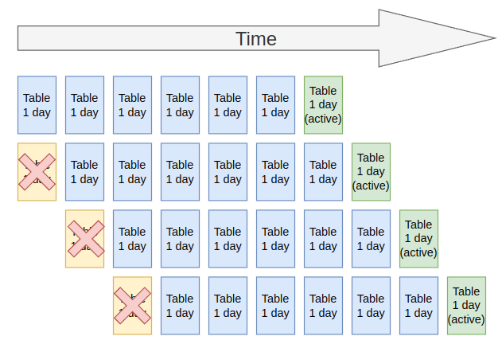

## Summary
* Event retention: 7 days of events are stored
* Event processing throughput: 3k-10k events processed a sec
* Event storage size: instance database size limit of 4 TB

## What stuff should be sent to ServiceNow Event Management? 
This article written by the ServiceNow employee "ricocenteno" says: 

> Monitoring DOES NOT mean the same as Event Management from an IT perspective. 
> 
> Monitoring is the act of understanding how something is performing or available. With this, it initiates an event in various forms and there are hundreds of monitoring tools out there that generate events. 

https://www.servicenow.com/community/in-other-news/how-servicenow-aligns-with-itil-event-management-best-practice/ba-p/2292599 

This suggest that only **events** should be sent to ServiceNow Event Management.
* CPU or memory usage thresholds being breached. 
* Notable issues occurring. 
* Software faults. 
* Informational Events 

**Monitoring** data should not be sent to ServiceNow Event Management.  
* Current CPU usage every 5 seconds. 
* Every time a web page is requested from a web server and how long it took to load. 
* Entire server logs. 

ITOM Health and Metric Health would be a better option for monitoring data. 

## Event processing 
So how many events can your ServiceNow instance handle? 

> Event Management - 3k-10k events a sec, with 1 million services which 20% of them getting alerts.
>
> Health Log Analytics - Standard deployment with single MID 18K logs/sec with multiple MIDs 50K logs/sec; We can scale to 240K logs/sec.
>
> *- roy_silon (ServiceNow Employee) 2024*
> 
> https://www.servicenow.com/community/itom-forum/event-management-limitation/m-p/2987328/highlight/true#M117280  

How did we get to that number of 3k - 10k events a second?

This article goes into some of the details of how events are processed by ServiceNow Event Management. I'd recommend giving it a read if you're curious about how ServiceNow processes the events. 

[KB0756665 Event Management - What is an Event and dealing with events](https://support.servicenow.com/kb?id=kb_article_view&sysparm_article=KB0756665) 

## Event Data Retention
All events are stored in the "Event" [em_event] table. 

By default, this table is on a **table rotation** of 1 day x 7 tables, which means **only the last 7 days of event data** will be stored.

## Database Size Limits 
The "Event" [em_event] table still lives within the ServiceNow instance database, and is bound to the same constraints. 

**Technically speaking** there is no limit on the database size, unless it's so stupidly large that it outgrows the hardware it lives on. 

**Contractually**, it depends on your subscription agreement. Typically, the contractual limit is **4 TB** in size, and extra space can be purchased in **1 TB** increments. 
* Some subscription agreements say the 4 TB limit is per-instance
* Some agreements say that size of all of your instances should be less than the 4 TB limit. 

If in doubt, contact your ServiceNow account representative.

## MID Servers 
MID servers can be used in Event Management in many ways, including:
* Being an SNMP trap where events are sent to the MID server.
* Pulling events from event / monitoring systems.
* Having events pushed to the MID server by event / monitoring systems.

The limiting factors are almost all performance and network bandwidth related, instead of licensing or technical limitations. 

ServiceNow does recommend only using 1 MID server as an SNMP trap per VLAN. 

Here's that the "MID Server Best Practices" guide from Now Create recommends 
https://nowlearning.servicenow.com/nowcreate?id=nc_asset&asset_id=559e2dd493b625505402393d6cba103a

| Product               | HEAP GB  | Memory GB  | CPU Cores  | HDD GB  |
|-----------------------|----------|------------|------------|---------|
| Discovery             | 1        | 4          | 4          | 50      |
| Service Mapping       | 1        | 4          | 4          | 50      |
| Health Log Analytics  | 1        | 4          | 4          | 50      |
| CPG                   | 4        | 8          | 4          | 50      |
| ACC                   | 8        | 16         | 8          | 50      |
| **EM/OI**                 | 4        | 12         | 4          | 36      |

**Note:** The default memory limit for MID servers is 1 GB. It will need to be raised manually by editing the `\agent\conf\wrapper-override.conf` file and giving it more.

ServiceNow has done some performance case studies for some examples. You can find the results here.

[SN Docs - MID Server system requirements](https://www.servicenow.com/docs/bundle/xanadu-servicenow-platform/page/product/mid-server/reference/r_MIDServerSystemRequirements.html#d390024e866)

## Links 
* KB0756665 Event Management - What is an Event and dealing with events 
 https://support.servicenow.com/kb?id=kb_article_view&sysparm_article=KB0756665 
* SN Community - Event management limitation 
 https://www.servicenow.com/community/itom-forum/event-management-limitation/m-p/996903 
* KB0995202 Events processing / processor queue limit (is SN events, not EM events!) 
https://support.servicenow.com/kb?id=kb_article_view&sysparm_article=KB0995202 
* KB0758422 Events assignment to Event Processing Jobs and how to Identify a hang/delay in an event processing job 
 https://support.servicenow.com/kb?id=kb_article_view&sysparm_article=KB0758422  
* KB0714092 Events Management events in ready state 
https://support.servicenow.com/kb?id=kb_article_view&sysparm_article=KB0714092  
* SN Community - Finding Size of Instance Database 
 https://www.servicenow.com/community/itsm-forum/finding-size-of-instance-database/m-p/551229  
* SN Community - What are data storage limits for an instance 
 https://www.servicenow.com/community/itom-forum/what-are-data-storage-limits-for-an-instance/m-p/930909 
* SN Blog - Unlocking Insights into Your ServiceNow Instance: Understanding Storage and Table Usage 
 https://www.servicenow.com/community/developer-articles/unlocking-insights-into-your-servicenow-instance-understanding/ta-p/2508342  