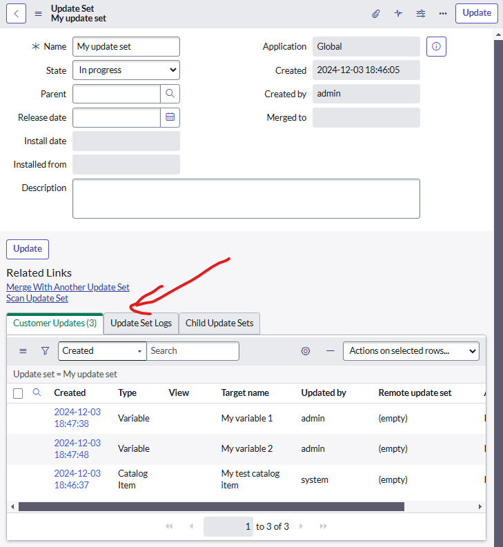
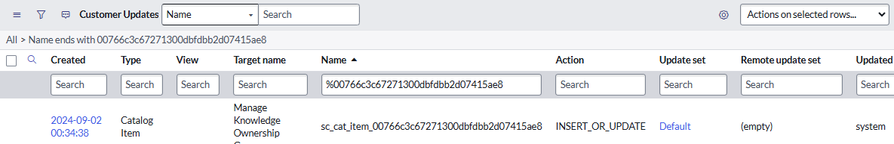
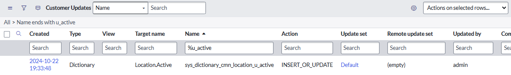
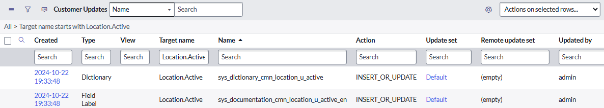
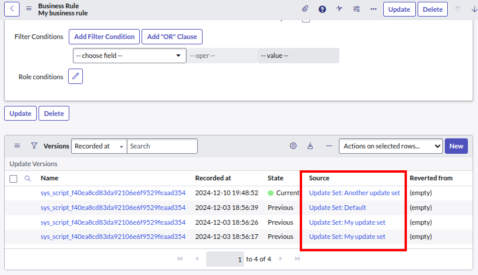

## Update set entries (sys_update_xml) 
An **Update set** is made of **Customer updates** which is the snapshots of record as they get changed. 

To search for changes to a record: 
1. Copy the sys_id of the record you want to find update sets for (except for changes to a field [sys_dictionary], see below). 
1. Open a list of "Customer updates" [sys_update_xml] by typing "sys_update_xml.list" into the navigator search then pressing ENTER. 
1. Apply a filter to search for changes. 

If it's **not** for a field on a table, search "**Name ENDS WITH (sys_id of your record)**".

If It's for a **field** on a table [sys_dictionary], search "**Name ENDS WITH (field name)**".

If in doubt, try searching the "Target name" field. You just might find the answer you're looking for. 

## Version (sys_update_version) 
A Version [sys_update_version] is created whenever a configuration is changed. It helps capture a version of the record including a snapshot of the record, and you can even revert back to a specific version. 

We can use them to try to find the update set related to the change was made. 

Here's a screenshot of the **Versions** related list at the bottom of the default Business Rule form. Note the **Source** column which is the update set the version was captured in. 

