I want to do a checkpoint of how things have been going using Linux on my main pc and some lessons learned. 

## Gaming has come a long way
Hot damn, gaming on Linux has come a heck of a long way! 

Back in the day, almost all games were made for Windows and you had to rely on [Wine](https://www.winehq.org/) to play games. Wine is a emulator of sorts for Windows programs, it would emulate Windows and DirectX and run them on Linux. 

Sometimes things "just worked". 
Sometimes you had to spend 3 days playing with wine to get a game to even start. 

[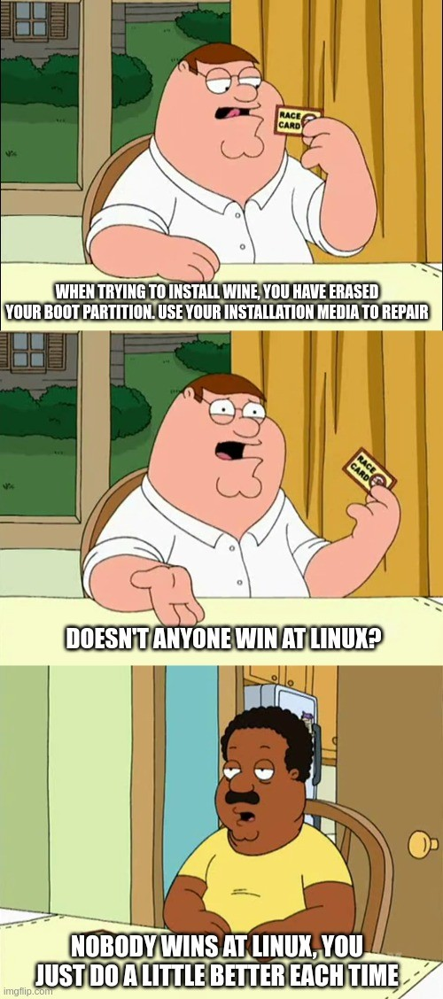](linux-wine-meme.jpg)

**Nowadays, things are much better!** 

A lot of games these days are built to run on Linux natively. Some of my favorites include: 
* War Thunder 
* Rimworld 
* Valheim 
* Minecraft 
* Factorio 
* Dwarf Fortress 

The popular gaming platform [Steam](https://steampowered.com/) comes with a tool called [Proton](https://protondb.com/) (it's like wine but focused on games) which can run almost all Windows games with either right out of the box or with some minor tweaks. 

## It really helped to write about hurdles and how I overcame them. If I had to start again, it's all there.
I found it helpful to start a note page for each challenge I ran into. I wrote about: 
* What the problem was (with screenshots) 
* Links to forums, articles, and Reddit posts about the same issue 
* What I tried 
* What fixed it 

If it ever came up again, or I had to do something else before fixing the issue, I knew exactly what happened and where I was. Saved me from pulling my hair out many times.

## A lot of things now have Linux versions
Most of the software I use now has native Linux versions. I was expecting that I'd have to find Linux alternatives for most of my apps, but I won't have to for most of them. 

There's native Linux versions for: 
* **Chrome** (web browser and all plugins) 
* **Steam** (gaming) 
* **Discord** (chat & video calls) 
* **VLC** (video playback) 
* **OBS** (screen capture & streaming) 
* **VS Code** (web dev / Arduino / app development) 
* **DropBox** (cloud file storage) 
* **Draw.io** (diagramming tool) 
* **KeePass** (password manager) 
* **Audacity** (audio editing) 

However, there's still some software I use that **don't** have Linux versions, and that is frustrating.
* **`Paint.NET`** (image editing) 
* **Microsoft Office** incl. OneNote (office software) 
* **Greenshot** (screenshots and quick image editing) 

I'll need to find alternatives, or get tricky with emulation or running a Windows virtual machine just for those programs. 

## Things "just work", most of the time 
Linux has come a heck of a long way in user experience. A decade ago, using Linux was like training a stubborn animal, with you trying to fight it into submission.

I'm pleasantly surprised at how easy to use Linux is these days, and many of the common features you'd expect from a computer work right out of the box.
* Multiple screens work without special software, and act as separate screens instead of one giant screen. 
* Many hotkeys in Linux are the same as Windows. 
* Nvidia graphics card drivers can be installed automatically. 
* USB devices appear automatically. 
* Logitech Unify keyboard and mouse devices can be managed. 
* Wifi "just works" without installing fancy drivers or editing config files. 
* Windows shares can be found in the file explorer without installing special software. 

Linux comes with a fancy app store / Software Manager to install most common software quickly. This isn't weird Linux knock-offs either, these are common in Windows too, like Discord, Steam, Blender, and VLC. 

[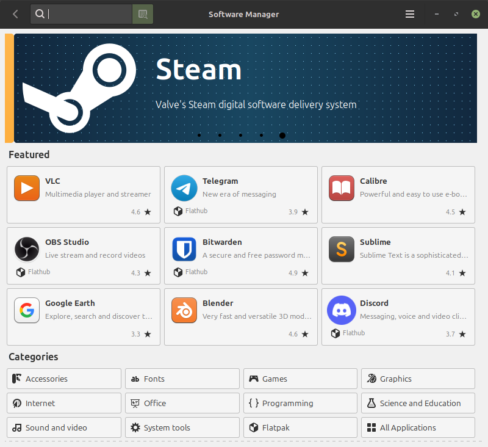](linux-software-manager.png)

## Things "just work"... after the first time
There are some things in Linux that you might think is "broken" right out of the box, but work fine after you've fixed it.

The good news is that there's a very active Linux community. Most likely there's an answer to most issues out there.

The Logitech Unifying Receiver doesn't work in Linux through a KVM (I use it to switch between my PC and my work laptop). I fixed it by disabling a driver, and now it works fine.

Middle-mouse scrolling didn't work right out of the box. I've added it to my configuration, and now it works fine. 

**Things will come up at the start. Take your time, stay patient, and Google your questions.** 

## Some things are different until you configure them 
There are things in Linux that feel unnecessarily or frustratingly different, but there's an option somewhere to make it more normal. 

One example is that images won't automatically get thumbnails in the file explorer when they're in a Windows share (e.g. my file server that has all my memes). You can do it manually by clicking on **View &gt; Show thumbnails**.
Or you can configure the file explorer to always create thumbails for images, no matter where they're stored.

[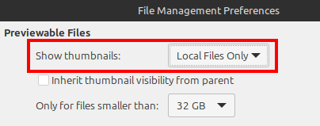](thumbnail-config.png)

Taking screenshots are a good example.  

**In Windows**: you press "Print Screen" (PrntSc) and it takes a screenshot and adds it to your clipboard so you can paste it right away. 

**In Linux Mint**: you press "Print Screen" (PrntSc) and it opens the "Screenshot" app. It doesn't automatically add it to the clipboard, you need to click "Add to Clipboard". 

I thought this was dumb and a bad user experience. 

[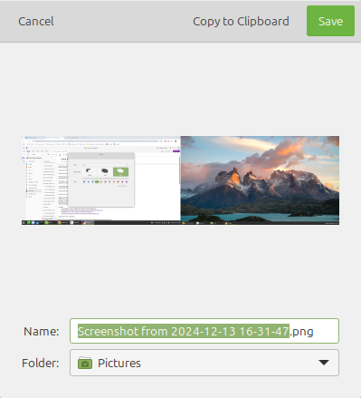](screenshot-popup.png)

However, I found that there **was** a shortcut to take a screenshot normally: **Ctrl+PrintSc** 
Turns out I can just change these shortcuts to make it work how I wanted it to work. 

[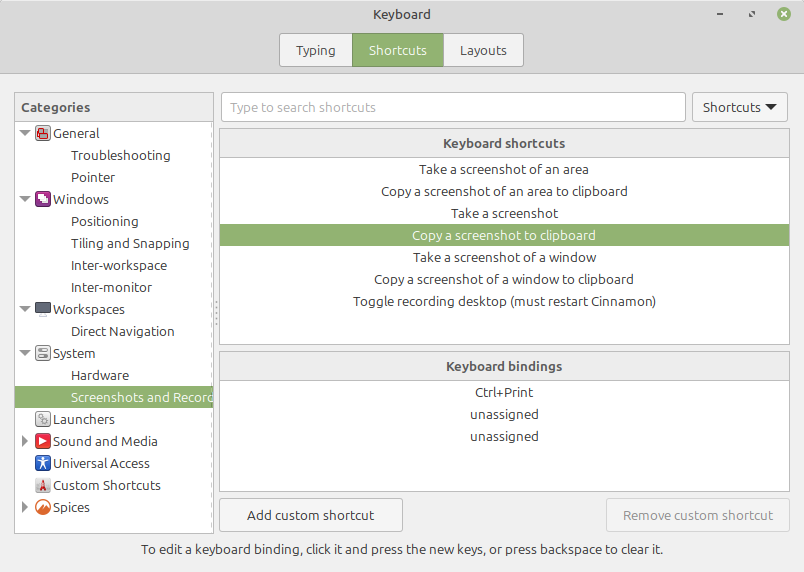](linux-shortcuts.png)

There's a few things like this in Linux, where things are frustratingly different, but can be changed if you can find the right setting. 

## Some things are just "different"
There are parts of the Linux Mint user experience which is different from Windows 10 and I'm not sure if it'll change. 

Maybe I should learn Desktop App Dev for Linux and fix it myself?

The clock can only have 1 line on it. I liked having the date and time on the clock in Windows 10. I can add it to Linux Mint, but it's all on 1 line.

Windows 10 clock

[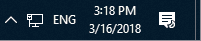](win10-clock.png)

Linux Mint clock

[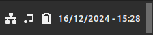](linux-mint-clock.png)

Chrome and YouTube will sometimes go full-screen on the wrong monitor. If I have YouTube open in Chrome on screen 1, and then go fullscreen, it'll sometimes fullscreen on screen 2.

You can't take a screenshot when a little menu is open (e.g. context menu, right-click menu, drop-down menu). This can be annoying.

Dragging and selecting files can be irritating in the Linux Mint file explorer Nemo if the thumbnail is really small. In Windows 10, the "box" that a file takes up is always the same size and doesn't change size if the media's thumbnail is really tall or really wide.

Here's me, not able to select a file with a very wide and short thumbnail, but selecting it's neighbor with a larger thumbnail.

[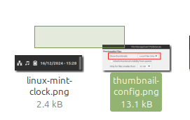](file-selection-thumbnail.png)

## Making Linux Mint look like the familiar Windows 10
I made my Linux look like the familiar Windows 10 because it's what I know, and what my work still uses. You can use these tutorials to make Linux Mint look very similar to Windows 10 using the (B00merang Project)[https://b00merang-project.github.io/] theme for Cinnamon (and other display managers like GNOME and KDE). It was pretty quick to do.

Tutorials:

* Libre Software - How To Make Linux Mint Look Like Windows 10 
https://libre2.news.blog/como-hacer-que-linux-mint-se-vea-como-windows-10  

* Howtogeek.com - How to make Linux look like Windows 10 
https://www.howtogeek.com/how-to-make-linux-look-like-windows-10/ 

[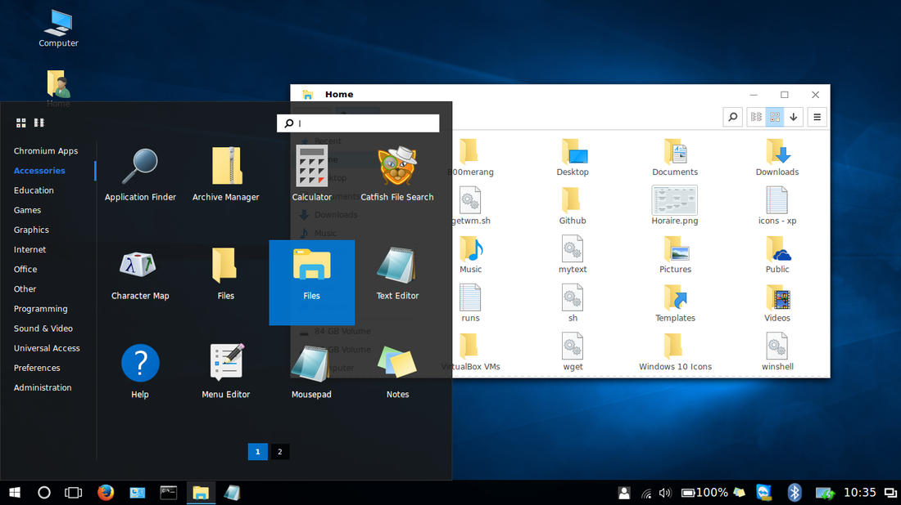](linux-theme-win10.png)

## Linux's folder structure is complicated
The folder structures are very different between Windows and Linux. 

With Windows, the folders are pretty simple: 
* `C:\Windows` is for system stuff 
* `C:\Program files` is stuff that's been installed for everyone 
* `C:\Users` is where user data is stored 

However, Linux has many different folders, and installed applications seem to be scattered across many folders which can make it challenging to try to find things. 

Linux nerds will get very angry with me, shouting at me that the Linux folder structure is plain and simple, but it's not.

*Diagram from https://www.reddit.com/r/linux/comments/qkm01c/a_refresher_on_the_linux_file_system_structure/*

I might make a blog article trying to unpick where everything is in Linux, and some examples of where popular well-known software installs themselves. 

## Image editing in GIMP is very complicated
I'm used to `Paint.NET` which has a simpler but effective user interface where things can be done quickly and simply. I've used it for years to make memes around the work office and for most of the images here on this site. 

[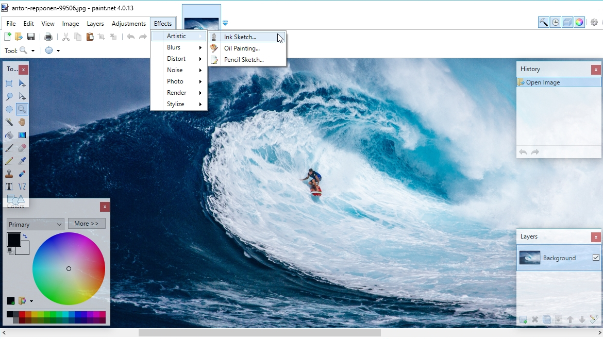](screenshot-paint-net2.png)

GIMP (GNU Image Manipulation Program) is praised by my as the Linux version of Photoshop. However, I find that compared to `Paint.NET`, GIMP feels complicated with an unintuitive interface that's complicated on purpose. It's UI is very "busy" with lots of icons, panels, and dotted overlays on the picture.  

[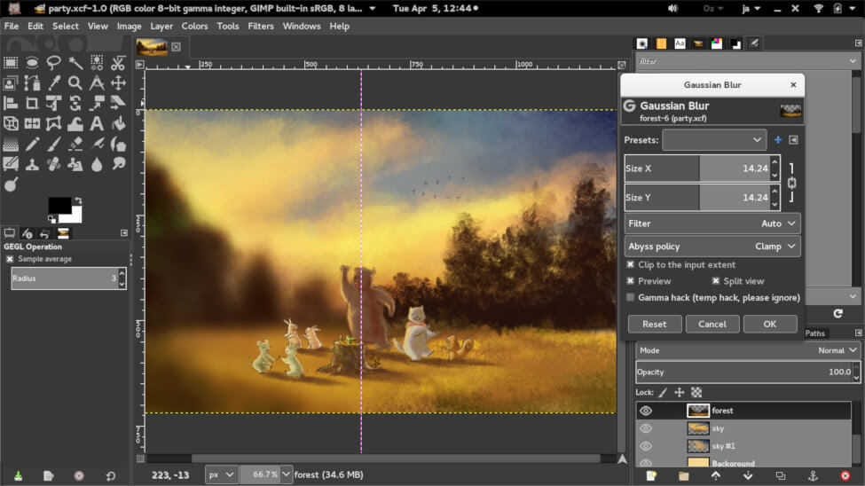](screenshot-gimp.png)

Maybe I'm just not used to it yet, but I'm finding it challenging to go from `Paint.NET` to GIMP. 

## Conclusion 
Linux has come a long way since I last tried to use it for my main PC. There's still some pain points that I’m working out, but I'm comfortable enough that I will keep going. 