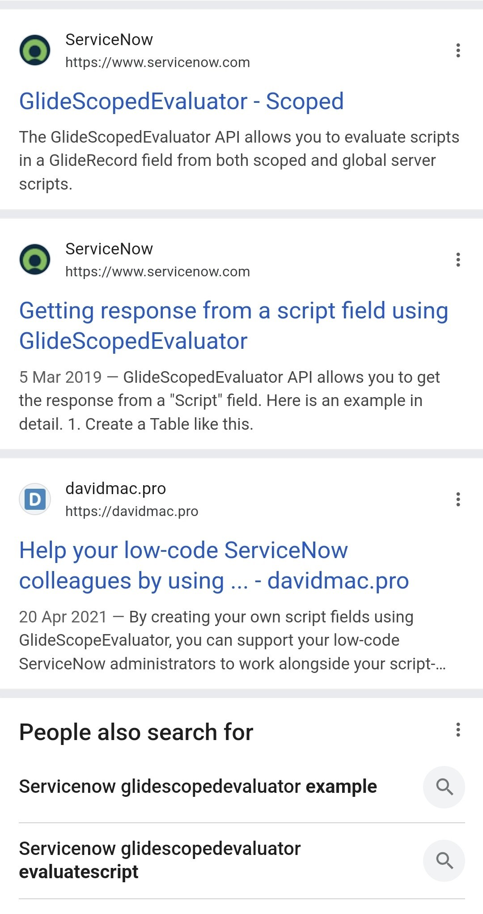

## SN Community would own my content 
Any content posted through the SN Community is considered the property of ServiceNow.

To quote their terms of use document (2025-01-22) 
https://www.servicenow.com/au/terms-of-use.html 

> 2. User of the Website - Posting 
> User Contributions are considered non‑confidential and non‑proprietary, and you hereby grant to ServiceNow a perpetual, irrevocable, royalty‑free, fully paid, sublicensable, transferable, nonexclusive, worldwide license to copy, distribute, modify, make derivative works of, publicly display, publicly perform, make, use, sell, translate and disclose to third parties any User Contributions that you post for any purpose. 

Don't get me wrong, I understand it from ServiceNow's perspective: If my website shuts down, it'll take down all of my articles, guides, and tutorials along with it. Hosting it on the SN Community website means it'll still be available to help & guide others even if I drop off the map.

That said, for now I'd prefer to retain personal ownership of my content.

## Standing out in search results 
By hosting my own article, they appear more prominently in Web search results (e.g. Google and Bing) instead of being aggregated & lost in the bundle of "top 5 results from SN Community".  

Here's a Google search for *"ServiceNow glidescopedevaluator"*. There's my blog article about it, standing out from the other results. It's hard to beat that sort of visibility.

## Merging ServiceNow ID moves your article ownership 
These days when you move around employers, ServiceNow wants you to "merge" your SN ID to and from: 
* a personal account 
* a partner / customer account 

SN KB article about it:
[KB0010208 - Merging (merge) my email (accounts),transfer certifications (learning history) to new email](https://nowlearning.servicenow.com/kb?id=kb_article_view&sysparm_article=KB0010208)

When you do this, it moves a bunch of things, including: 
* Community Posts 
* Community Comments 
* Community Badges 
* Community Accepted Solutions 

If I did all of my posts in SN Community, that means that all of my articles will be migrated away from my personal SN ID, and I'm not comfortable letting go. 

## SN Community updates break links 
In the past, some of the larger SN Community website updates have changed the URLs and links. An unfortunate downside is that any existing links won't work anymore. 

E.g. (different articles, but showing the difference)
URL format before update: https://community.servicenow.com/thread/193459 
URL format after update: https://www.servicenow.com/community/cloud-cost-management-forum/quot-connection-to-azure-balance-summary-failed-quot/td-p/3152516 

This breaks: 
* links in SN Community posts linking to other articles 
* links in external websites (e.g. the SN subreddit) linking to SN Community posts 
* Google search results for SN Community posts 

I still run into links around the internet that say "this SN Community discussion has the answer that you need", but the link is broken and I can't find the discussion anymore.

By hosting articles on my own website, those links to my articles should always work for as long as I keep the website alive. 