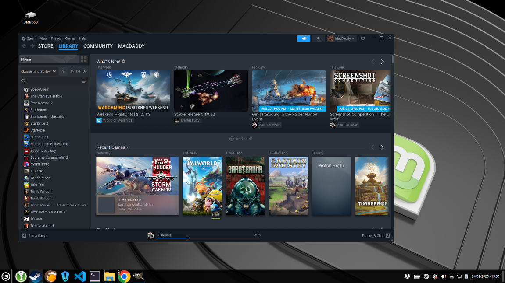
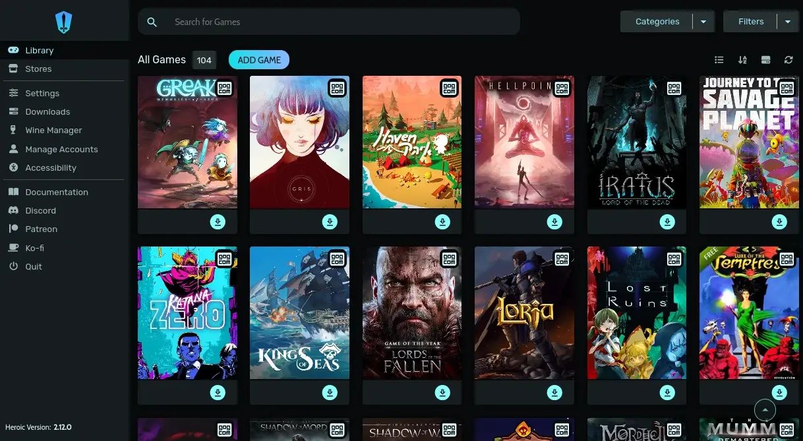
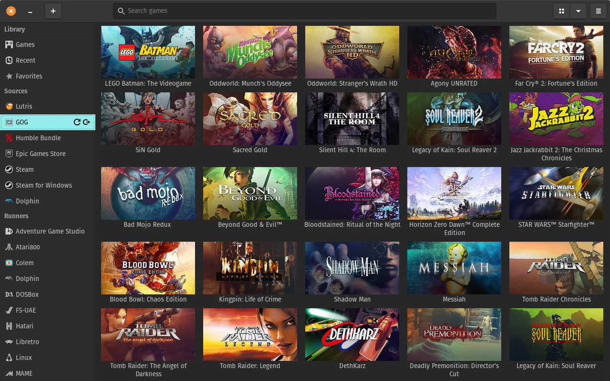
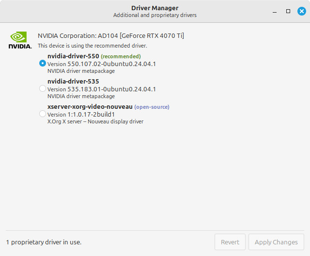

## 1. Steam is awesome. Most games "just work". 
Steam has invested a lot of time and effort into Linux games. A lot of games either:
* have a Linux-native version that should run just fine, or
* work great in Steam Proton, which runs Windows software in Linux.

Thanks to Steam's efforts, almost all of the games I've tried running from my Steam library "just works" when I run them on my Linux PC.

## 2. Save time and use a game launcher (Lutris, Heroic)
Steam works great when you're trying to play a game through Steam, but what if you want to play a game outside of Steam?

Instead of spending hours of time fiddling and tweaking, trying to get your game to run, just use a game launcher like **Lutris** or **Heroic Launcher**. These launchers do most of te magic for you, saving you time a frustration.

**Heroic Launcher** is a good choice for a launcher. 
* easy to install
* open games from your computer, or from games stores including Steam, GOG, Epic, and Humble Bundle
* auto-fetches game metadata for your games, including thumbnails, descriptions, and ratings
* UI built in Electron (a little slower)

Heroic Launcher is the best launcher for running games from the Epic Games Store, it works great.

**Lutris** is another great choice.
* UI built in GTK (it's fast)
* easy to install
* opens emulated games for consoles and arcade machines
* open games from your computer, or from games stores including Steam, GOG, Epic, and Humble Bundle
* auto-fetches game metadata for your games, including thumbnails, descriptions, and ratings

Lutris isn't as good for running games from the Epic Games Store. It launches the entire EGS client, along with bloat like the Epic social overlay. Epic games will suffer performance losses. However, non-Epic games still run fantastic.

## 3. Install the latest GPU drivers (NVIDIA and AMD)
In most cases, updates for your NVIDIA and AMD graphics devices come with fixes, features, and performance improvements. 

In most cases, you'll want to always use the most up-to-date version available.

There are rare cases where updated version will cause issues, but it's more common that the newer versions fix problems instead of cause them.

Most version of Linux will come with a tool where you can easily select and install a GPU driver. In Linux Mint, it's the Driver Manager tool.

## 4. Use the Linux gaming forums, groups, and subreddits
Gaming on Linux has gained a lot of traction over time, and there's plenty of gamers that use Linux these days. Many of them have shared there tips, tricks, and successes on getting games to run on Linux. 

These areas are a great help if you get stuck.

* Reddit - linux_gaming
 https://www.reddit.com/r/linux_gaming/ 

* Gaming on Linux
 https://www.gamingonlinux.com/  

* Linux.org - Gaming
 https://www.linux.org/forums/linux-gaming.202/  

* Linux Mint Forum: Gaming 
 https://forums.linuxmint.com/viewforum.php?f=225&sid=03684d7beab83751464ae42bd94d8991  

## 5. Don't play games from your Windows drive (NFTS)
These days, Linux can open and use your Windows (NTFS) drives with ease. However, you still shouldn't run games from a Windows (NTFS) drive.

You'll likely run into issues, including:
* Performance issues, NTFS can be demanding on the CPU.
* Compatibilty issues between Linux and Windows file systems
 https://github.com/ValveSoftware/Proton/wiki/Using-a-NTFS-disk-with-Linux-and-Windows

The difference is that Linux file system drivers (ext4, brtfs, reiserfs, etc) are baked into the foundations itself (the kernel) whereas the NTFS driver is a userspace utility that has more overhead involved because NTFS doesn't work the same way that Linux does.

I was playing Barotrauma and would often freeze and crash when loading a new level. Turns out it was because the performance overhead was bottle-necking and pausing the game so much it would time out and crash.

Just run your games from a Linux drive, and that'll solve that problem.