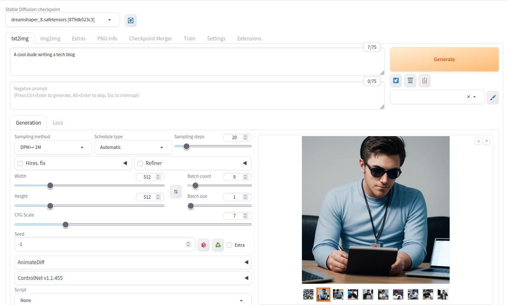
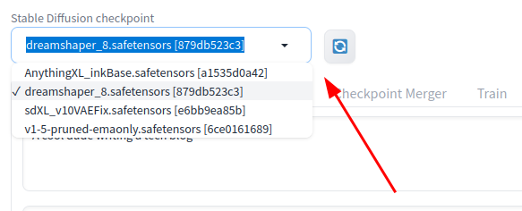
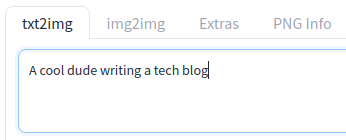
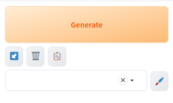
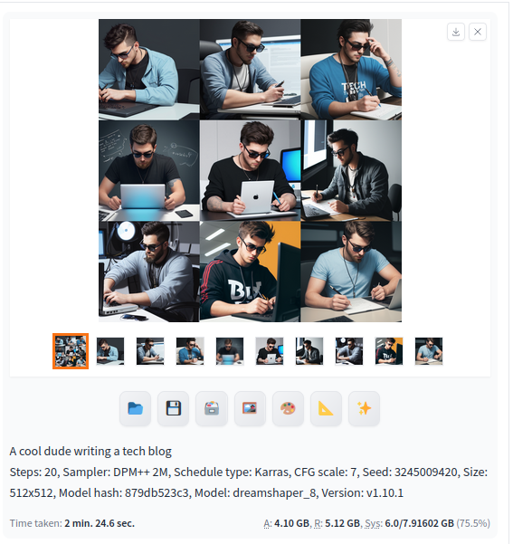

## The background 
Generative AI can be used to make images from a text prompt. You describe what you want to see, and it'll generate a picture from your description. 

There are many online services that can do this for you, but most require you to: 
* pay to use it 
* give it your email address so they can spam you 

A better option is to simply host your own image generation AI from your own computer! 

A popular and **free** option is Stable-Diffusion from Stability-AI. 

https://stability.ai/stable-image 

The tool is a command-line tool that isn't friendly for non-experts, but there are some graphical user interfaces that've been made to make it much easier to use. 

## Getting started 
Getting up-and-running is pretty easy.

1. Install Stable Diffusion WebUI (sd-webui) by Automatic1111 (a web GUI for Stable Diffusion) 
 https://github.com/AUTOMATIC1111/stable-diffusion-webui/wiki/Install-and-Run-on-NVidia-GPUs
1. Choose a **checkpoint** from civitai.com. This will drive what your pictures will look like.
 https://civitai.com/models?tag=base+model 
 DreamShaper is a good all-round option. 
 https://civitai.com/models/4384/dreamshaper  
1. Copy the checkpoint file (".safetensors" file) into the "/models/Stable-diffusion/" folder in the sd-webui folder. 
1. Start Automatic1111 and have **fun**! 

## Generate some images 

Once you're up and running, you can generate images by: 

1. Select a checkpoint.

2. Enter a prompt, describe the image to generate. 

3. Click on "Generate". 

I like to create multiple low-res images, then choose one to generate in higher detail. 

1. Set "Width" and "Height" to 256. 
1. Set "Batch count" to 9. 
1. Generate the images, then pick **seed** of the pic I want to keep, and use it to generate 1 higher-res image. 

**Congratulations**, your computer is now running an AI that can generate images from your prompts!

## 

## Model? Checkpoint? LoRA? 
I like the explanation given by u/LJRE_auteur for what these are. 
https://www.reddit.com/r/StableDiffusion/comments/196ikpo/what_is_a_lora_and_how_do_i_use_it/ 

> When you use Stable Diffusion, you use **models**, also called **checkpoints**. AI models come in two types : **pretrained**, and **fine-tunes**. 
> 
> Making a pretrained model is extremely expensive (**you need multiple GPUs running full time for days**), which is why research leaned towards finetunes. 
> 
> A finetune is a modification of an existing model. Since a big base already exists, it's much less expensive. But it's still a lot. 
> 
> A LoRA (Low Rank Adaption) is a sort of finetune that is very **very** specific. It's so efficient **it can be done in half an hour on a consumer grade gaming computer**. And more importantly: instead of "teaching" the AI multiple concepts, you just teach it a few, typically a single one.  

A LoRA can come in many forms and help fine-tune the generated image: 
* A specific character or image of a person. (e.g. Misty from Pokemon, or an image of yourself) 
* A theme to apply (e.g. a scene from the game Titanfall, or a Studio Ghibli theme). 
* Fixes (e.g. improved hands). 
* Tweaks (e.g. heart shaped eyes in anime characters). 

## Links 
* YouTube - Civitai Beginners Guide To AI Art // #1 Core Concepts 
 https://www.youtube.com/watch?v=IIy3YwsXtTE 