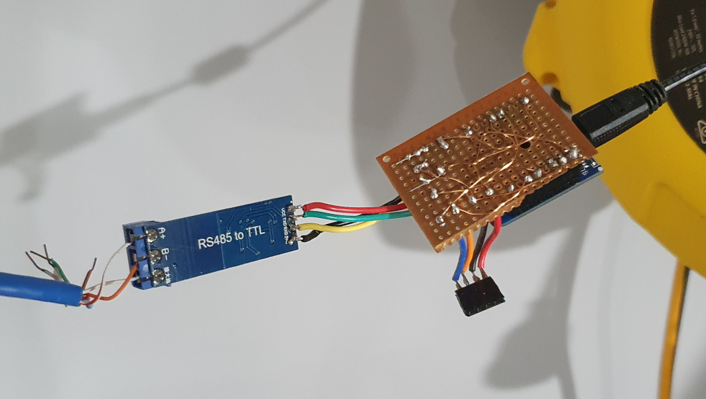

## Prototype 
I'm still working on this project where I’m trying to create an IoT sensor to pull data from my solar inverter (Solis Delta Solivia 5.0 APG3 EOE46010301) and feed it back to my smart home controller, Home Assistant. 

It's been about a year since I started, but life has been getting in the way a fair bit. I've made lots of progress, but I haven't made as much success as I'd like.

I've been able to create prototype that's able to pull date from the unit, and send the data as log messages to a debugger. That's been half the battle, I'm proud of the code that I've written to get it out in the first place. 

I've made a GitHub repository for the code. At this time, it's still a work in progress. 
https://github.com/towerofpower256/DeltaReaderMinimalViable 

Here's some photos of the prototype plugged into my inverter. 

[](setup-1.jpg)

[](setup-2.jpg)

[](setup-3.jpg)

Here's the wiring diagram. 

[](wiring_diagram.jpeg)

I made my own UDP Logger to send logging messages over Wifi which I could read on my mobile phone. I'm quite proud of that one. 
The log messages are broadcast to the whole network, so anything can listen to them. 

Here's the app "UDP-TCP-REST Network Utility" on my Android phone receiving the log messages. 

[](udp-listener-android-mobile.jpeg)

Here's a tool on Linux receiving the log messages (on UDP port 12345). 

```
netcat -u -k -l 12345 
```

[](udp-listener-linux-netcat.png)

## Challenges 
### Incorrect values 
Some of the values that I'm getting out don't appear correct. I'm pretty sure it has to do with how I'm reading them by mashing multiple bytes to make later numbers, and it's getting it mixed up in the process. 

For example, the real voltage on Solar 1 is around **285 V**, but I'm getting **256 V** (oddly specific number for computers).

For example, the data says that the AC voltage is **285**, but the real value is closer to **240** V. 

More testing and validation required. 

### Wemos D1 Mini board can't do serial over serial pins 
I ran into a confusing issue where I couldn't connect the RS485 module to the serial pins on the Wemos D1 Mini board. For some reason, it just wouldn't work, but serial over the USB port would work just fine. 

The issue is that the microcontroller's Rx pin connects to the USB controller using a pull-up resistor, which interferes with anything trying to use the Rx pin for anything else. 

I ended up using a software serial library and some spare GPIO pins for the serial connection to the RS485 module to the inverter. 

### Large messages vs many smaller messages 
I've been able to fetch the data, but there's a lot of data that comes back. If I put all of that data in 1 large JSON message, I'll start hitting message size limits. 

The data size of the **Statistics** data that comes from my inverter is **159 bytes**. 

By default, the library `ArduinoJson` tries to dynamically allocate memory, that shouldn't be an issue. 

By default, the library `PubSubClient` used to send MQTT messages has a buffer size of **256 bytes**. Although the inverter data will always be less that 256 bytes, that's **binary** data, whereas JSON is a string message with formatting like brackets, braces, and quotation marks, and data is sent as ASCII characters, not raw binary. That limit will very quickly be hit. 

By default, the ESP8266 `WifiClient` responsible for sending and receiving messages is limited to **1460** bytes. 

I could send each data point as its own MQTT message, all 61 of them. However, there's overhead for each MQTT message, so transmission takes around 200ms-500ms per message. 500ms x 61 items = 30.5 seconds to send a full update. That's not OK. 

More research required. 

## What's next? 
I still have a few hurdles to overcome. 
* Add a web GUI that can setup the device and see live data. 
* Capture and feed data back to an MQTT server, that can then send it on to Home Assistant. 
* Home Assistant auto discovery support. 
* Fix accuracy issues. 