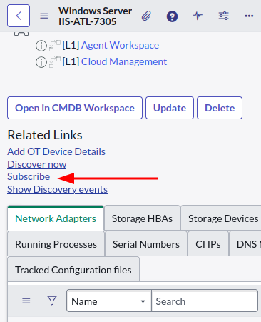

## Overview 

Out of the box, subscribing to a CI will notify you if an incident is raised for a CI that you're subscribed to. Subscription notifications aren't present out-of-the-box for other processes, including: 

* Problem 
* Change 
* Release management 

Notifications are sent to CI subscribers when an incident's state changes. Notably, they will not be sent when the incident is created, only when the state is changed. 

It's driven by the "Affected CIs" [task_ci] related list for incidents. When an incident's state changes, notifications will be sent out to all subscribers for any CIs in that list for that incident. 

[](screenshot-affected-ci.png)

Here's what the notification email looks like by default. 

[](affected-ci-email.png)

Notably, services added to the "Impacted Services/CIs" [task_cmdb_ci_service] related list will not trigger notifications to users subscribed to those CIs or service records. 

## Dave's thoughts 
> I think this functionality could be very useful, but disappointing as it comes out-of-the-box and could use an update. 
> 
> It's disappointing that notifying CI subscribers only happen on incidents. It'd be nice to get notified if a change or outage is created for your CI. 
> 
> It's also disappointing that you can't subscribe to a service or business application, and then get notifications when a supporting CI gets an incident, outage, or change. I think that'd promote visibility for service owners. 
> 
> In the future, I might explore the idea of improving the CI Subscription functionality in my own time. I see the benefits it would bring. 

## Not that "Subscribe", the other one 
The word "Subscribe" is used a lot by the platform ServiceNow. This is not: 

* Subscription Management for ServiceNow licenses or licensed features. 

* Subscribed users in Service Portfolio Management (grants visibility to catalog items under that service) 

* Knowledge Management subscriptions 

* Chat channel subscriptions 

## Subscribing to a CI 
You can subscribe to a CI by opening a CI and then clicking on the **Subscribe** UI action in the "Related links" section of the form. 

[](subscribe-button.png)

This will create a **Subscription [sys_notif_subscription]** between your user and that CI. This record is typically hidden, but here's what it looks like. 

[](subscription-record.png)

## Managing subscriptions 
Normally, the **Subscription [sys_notif_subscription]** table: 
* isn't in the navigator 
* isn't included at the bottom of any forms as related lists 
* isn't shown on a user's profile 

This means that it's difficult to manage subscriptions without knowing you can navigate to the **Subscription [sys_notif_subscription]** by name. 

To manage or "unsubscribe" from a subscription, simply edit or delete the records in this table. 

## How does it work? 
The *magic* starts when a business rule or other script creates **"ci.notification.for.task"** events. The business rule "Affected ci notifications" runs on state changes to tasks and: 
* Checks if any of the CIs in the "Affected CIs" [task_ci] for that task have CIs that have subscribers. 
* Triggers the **ci.notification.for.task** event. 

The script action "Handle Affected CIs for Task" listens for these events and uses the script include "CMDBAffectedCINotificationsUtils" to: 
* Check if there's any subscriptions that match the affected CIs on the task. Remember: CI subscriptions can have conditional filters on them. 
* Trigger the relevant notification email to the subscribed user using the event "ci.affected".

This then triggers the notification "CI affected". 

[](affected-ci-notification-1.png)

[](affected-ci-notification-2.png)

## How to make notifications work for subscribed CIs on more than just incidents 
Out of the box, notifications are only sent for **incidents** that affect a subscribed CI. However, the functionality is flexible enough that you can easily make ServiceNow do notification for all kinds of tasks. 

1. Open the notification "CI affected". 
1. Change "Table" from "Incident [incident]" to "Task [task]". 
1. Update the "Message", replace the word "view Incident:" to "view Task:" (does more than just incidents now). 

That's it. Notifications will be sent for subscribed CIs affected by more task types than just incidents. 

**Note**: there should only be 1 notification where the trigger event is "ci.affected". If there's more than 1, the UI Action that creates the subscription can get confused about which notification to add the subscription to, and pick one at random.

For more information, see `_getCIAffectedNotificationTypes` in the script include "CMDBAffectedCINotificationsUtils". 

```js 

_getCIAffectedNotificationTypes: function() { 
        var gr = new GlideRecord('sysevent_email_action'); 
        gr.addQuery('event_name', 'ci.affected'); 
        gr.addActiveQuery(); 
        gr.query(); 
        var ids = ''; 

        while (gr.next()) { 
            ids += gr.getValue('sys_id'); 
            if (gr.hasNext()) ids += ','; 
        } 
        return ids; 
    }, 
```

## Links 
* KB0694157 - How does 'subscribe' notification work for CI? 
 https://support.servicenow.com/kb?id=kb_article_view&sysparm_article=KB0694157 
* SN Community - Subscribe to CI 
 https://www.servicenow.com/community/developer-forum/subscribe-to-ci/m-p/2477197 