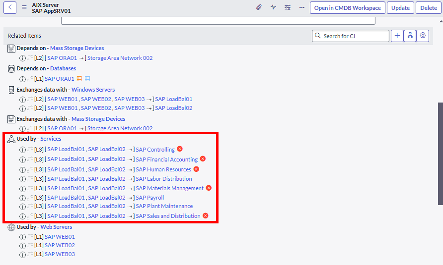
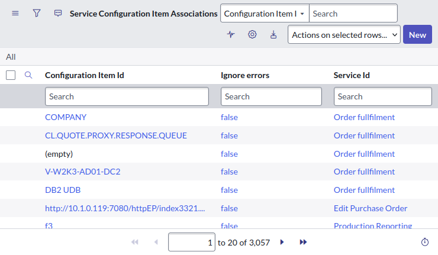

## The CI Dependency View 
From the Dependency View, you can click on a CI in the graph and see the services it supports by: 

1. Clicking on "Details". 
1. Clicking on "Related Services". 

[](dependancy-views.png)

> **Dave's thoughts:** This can be useful and easy to use, but it's a shame the services aren't in a list. It's annoying when large service names get shortened in this view. 

## The Relationship Formatter 
The Relationship Formatter on the CI form shows a lot more relationships than the immediate Relationships [cmdb_rel_ci] records that point directly to the CI you're looking at. 

For example, if you look at a server CI, the "Used by - Services" section shows relationships to services, but there are no Relationship [cmdb_rel_ci] records directly linking the server CI to that service. Somehow, ServiceNow is automatically figuring that out.  

Below is a screenshot of the Relationship Formatter showing many relationships.

[](relationship-formatter.png)

Here's the relationship editor. You can see that there are no relationships defined, but they still appeared in the relationship formatter.

[](relationship-editor.png)

> **Dave's thoughts:** probably the easiest way to find services that a CI supports, it can be seen by anyone and it's right there on the CI's form. It's great how the services are figured out by the platform automatically. However, it cannot be added in reports or data exports. 

## The table svc_ci_assoc 
The table "Service Configuration Item Associations" [svc_ci_assoc] is a regularly updated table linking CI's to the services they support. 

[](cmdb_ci_assoc.png)

So what makes records in this table? 

* Mapped services? **Yes** 
* Tag-based services? **Yes** 
* Dynamic CI groups? **Yes** 
* Manual relationships? **No**. Creating a chain or relationships from a CI up to a service **will not** create an svc_ci_assoc record. 

> **Dave's thoughts:** This table is great if you need to do a data export of the CI's that support a service. But remember: this table only has associations for automatically mapped CI-to-service relationships, not manual ones. 

## Script Include CIUtils 
For the pro-code developers and administrators, there's a script include called `global.CIUtils` that has some functions like: 
* _getImpactedServicesFromAffectedCIs 
* servicesAffectedByCI 

The function `servicesAffectedByCI` gets services by: 
* Getting services by relationship by running `SNC.CMDBUtil.getRelatedServices(ci, maxDepth, maxSize)` 
* Getting services by mapped services by running `SNC.BusinessServiceManager().getServicesAssociatedWithCi(ci, useSvcCiAssoc)` 

It looks like it's driven by the table: 

`svc_ci_assoc`

This table is apparently an m2m table linking CIs to the services that they support. 

However, the Java class `SNC.CMDBUtil.getRelatedServicesV2(id, maxDepth (10), maxSize (1,000) )` **will find services for a CI that were related manually**, in improvement over just using the [svc_ci_assoc] table. 

Here's an example using the script to get services related to a CI. 

```js 
var id = "3a70f789c0a8ce010091b0ea635b982a"; 

var services = j2js(SNC.CMDBUtil.getRelatedServices(id, 10, 1000)); 

for (var i=0; i < services.length; i++) { 
    var serviceID = services[i]; 
    var grS = new GlideRecord("cmdb_ci"); 
    grS.get(serviceID); 
    gs.print(""+(grS.getDisplayValue() || "(empty)")+" ("+serviceID+")"); 
} 

// *** Script: SAP Materials Management (26e44e8a0a0a0bb40095ff953f9ee520) 
// *** Script: SAP Controlling (26e46e5b0a0a0bb4005d1146846c429c) 
// *** Script: SAP Sales and Distribution (26e494480a0a0bb400ad175538708ad9) 
``` 

> **Dave's thoughts:** In the future, I'm going to try using this to automatically populate the "Impacted Services/CIs" related list on incidents. Watch this space! 


## Links 
* SN Reddit - Impacted Services/CIs list on Change 
 https://www.reddit.com/r/servicenow/comments/15lq280/impacted_servicescis_list_on_change/ 
 
* SN Docs – View CI List 
 https://www.servicenow.com/docs/bundle/yokohama-it-operations-management/page/product/service-mapping/task/view-ci-list.html 
 
* SN Docs - Get Related Services for a CI (Dynamic CI Group) 
 https://www.servicenow.com/docs/bundle/yokohama-servicenow-platform/page/product/configuration-management/task/unified-map-show-app-service.html 
 
* SN Community - Get Related Services for a CI (Dynamic CI Group) 
 https://www.servicenow.com/community/common-service-data-model-forum/get-related-services-for-a-ci-dynamic-ci-group/m-p/339196 
 
* SN Community - Get the Application Service of a CI 
 https://www.servicenow.com/community/developer-forum/get-the-application-service-of-a-ci/m-p/2954538 
 
* SN Docs - CI relations formatter 
 https://www.servicenow.com/docs/bundle/yokohama-servicenow-platform/page/product/configuration-management/concept/c_CIRelationsFormatterNG.html  
 
* SN Community - App Services mapped to a CI - SNC.BusinessServiceManager()? 
 https://www.servicenow.com/community/common-service-data-model-forum/app-services-mapped-to-a-ci-snc-businessservicemanager/td-p/2623634  
 
* SN Community - Application Services: How to use them? 
 https://www.servicenow.com/community/common-service-data-model/application-services-how-to-use-them/ta-p/2308712 
 
* SN Community - Application Services: Tips and Tricks
 https://www.servicenow.com/community/common-service-data-model/application-services-tips-and-tricks/ta-p/2309696 