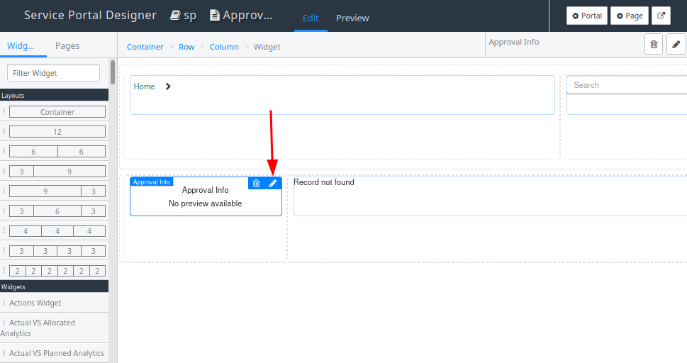

## The problem 
It's almost always desirable to that approvers give a reason whenever they reject something. Unfortunately, ServiceNow can sometimes allow approvers to reject something without giving a reason why.

This can be a deal-breaker for some customers. But what can you do to solve it?

## The solution 
There is no magic fix for this. Each way of answering approvals will need its own solution. 

Luckily, ServiceNow has already provided a solution in most cases.

* **Core UI - Form**: Already mandatory, no change required.
* **Core UI - List UI Action**: Customisation required.
* **Service Portal**: Option to make mandatory must be turned on.
* **Employee Service Center**: Already mandatory, no change required.
* **Now Mobile**: Already mandatory, no change required.

### Core UI, form view 
When rejecting an approval from the form in the Core UI, it makes the "Comments" field mandatory, forcing the user to provide a reason for rejecting the approval. 

**No change is required.**

[](screenshot-core-ui-approval-form.png)

### Core UI, list UI action 
Approvals can be rejected by right-clicking on them and clicking on "Reject". Doing so will reject the approval without needing to provide a reason. 

[](screenshot-core-ui-approval-list.png)

The easiest solution to this is to **disable the UI action**. This will prevent users from rejecting approvals from a list at all. Let's be honest, it's only used by system admins performing testing or maintenance, and not used by real approvers. 

### Service Portal 
Out of the box, approvers can reject approval requests without the need to give a reason. 

This is the case for 
* The "Approvals" widget on the home page. 
* The "Approvals" widget on the "My approvals" (approvals) page. 
* The "Approval info" widget on the "Approval" (approval) page. 

The "Approvals" widget on the home page. 

[](screenshot-sp-homepage.png)

The "My approvals" page. 

[](screenshot-sp-approvals.png)

The "Approval" page with the "Approval info" widget. 

[](screenshot-sp-approval.png)

The solution is easy. Lucky for us, the widgets already have the ability to require a rejection reason out-of-the-box. It just needs to be turned on in the **widget instance options** for each widget. 

1. Open the "approval" page in the Service Portal Designer. 
2. Open the widget instance options by clicking on the little pencil. 

[](sp-form-designer.png)

3. Turn on "Comments mandatory for rejection" then click on "Save". 

[](sp-widget-instance-options.png)

Do this for all 3 widgets (and any other places where users can action approvals in the SP). 

Now when someone tries to reject an approval, a modal pop-up will appear asking the user to provide a reason for the rejection. 

[](sp-approval-rejection.png)

**Fun fact:** Fixing this used to involve customising the widget. I'm very happy that ServiceNow now gives us this feature out of the box. 

### Employee Service Center 
Approvals appear a little different in the ESC (Employee Service Center, the new Service Portal) compared to the Service Portal. 

Approvals in the ESC all require a reason to by able to reject them. **No change is required.**

**My tasks page** 

No changes are required out-of-the-box for the "My tasks" page, approvals cannot be rejected without a comment, and users get warned with a message if they try. 

[](esc-my-tasks.png)

**My active items widget** 

No changes are required out-of-the-box for the "My active items" widget on the ESC home page. Pressing on "Reject" will ask the user to provide a reason for rejecting the approval. 

[](esc-my-active-items.png)

### Now Mobile 
When rejecting an approval via the Now Mobile app on mobile phones, it will force the approver to provide a comment when rejecting an approval by opening a rejecting form when "Reject" is clicked. 

No changes required there. 

Here's what the approval form looks like.  

[](mobile-approval-form.jpeg)

Here's the form that appears when the "Reject" button is pressed. 

[](mobile-approval-reject-reason.jpeg)

## Don't use Business Rules 
You might think: 

> I can simply use a Business Rule to prevent setting the "State" to "Rejected", and add a message asking for a comment. 
> ```js
> current.setAbortAction(true);
> gs.addErrorMessage("Please provide a comment when rejecting an approval");
> ``` 

Sadly, the message isn't always shown to the user in all places you can respond to approvals. 

For example, if you reject on the Service Portal and it's rejected by a Business Rule, the user just gets a message saying "Update failed". That's it. 

[](business-rule-breaking-approval.png)

## Links
* https://support.servicenow.com/kb?id=kb_article_view&sysparm_article=KB0720583
* https://support.servicenow.com/kb?id=kb_article_view&sysparm_article=KB0964990 
* https://hishowcase.service-now.com/kb?id=kb_article_view&sysparm_article=KB0752216 
* https://www.workingcode.in/question/servicenow-widget-with-reject-comments-mandatory-on-service-portal-working-code/ 
* https://www.cdw.com/content/cdw/en/articles/digitalworkspace/how-to-improve-the-servicenow-portal-approvals-process.html 
* https://support.servicenow.com/kb?id=kb_article_view&sysparm_article=KB0752216 
* https://support.servicenow.com/kb?id=kb_article_view&sysparm_article=KB0786276 
* https://support.servicenow.com/kb?id=kb_article_view&sysparm_article=KB1165921 
* https://support.servicenow.com/kb?id=kb_article_view&sysparm_article=KB0995282 
* https://www.servicenow.com/community/developer-forum/make-quot-rejection-quot-comments-mandatory-while-rejecting-a/m-p/2116823 
