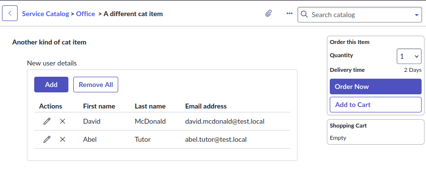
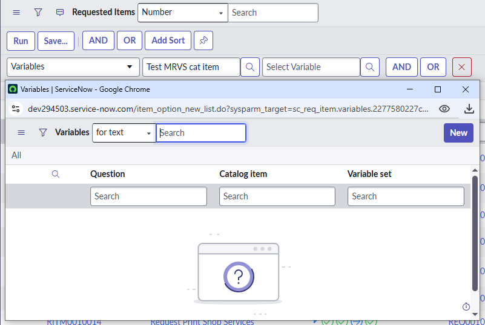
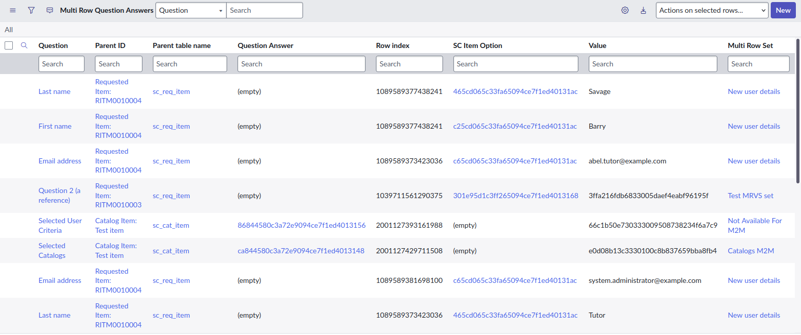
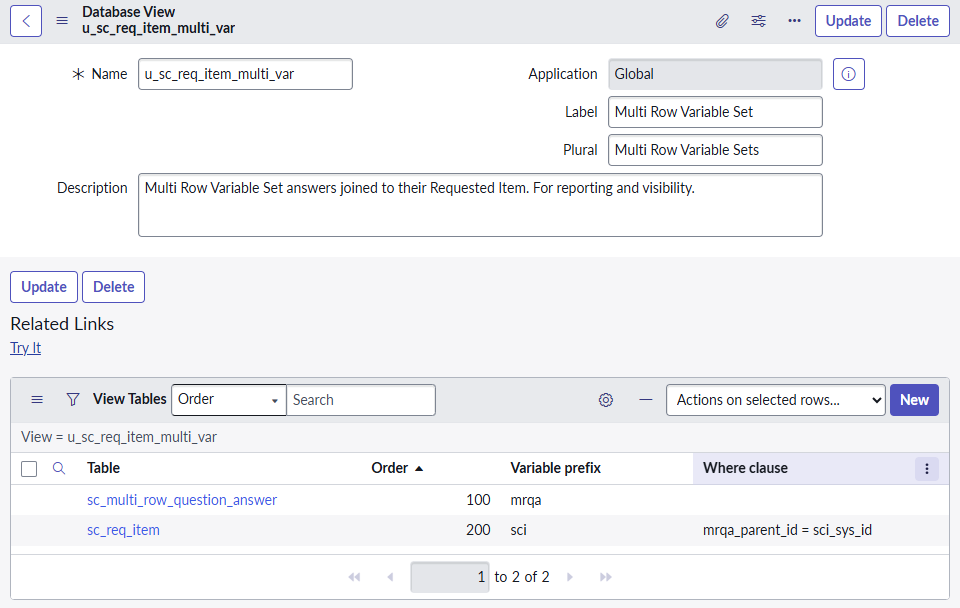
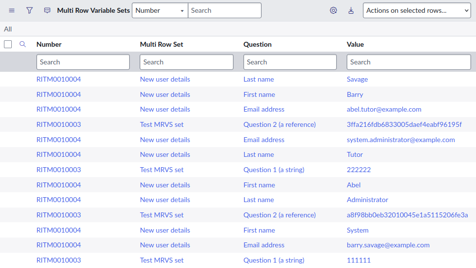

## The challenge 
Multi-row variable sets (MRVS) in ServiceNow Catalog items are a useful tool for capturing multiple rows of information on a form without the need to create a new table. 

Examples include: 
* capturing a list of users to add to a group. 
* a workplace incident form capturing who was hurt and what injuries they suffered. 
* a request for a new server capturing details for hard drives / storage volumes to be added. 

However, as great as they are, it can be difficult to report or filter on the data within an MRVS. 

MRVS variables don't appear in the conditions of a list in the list of available variables. 

## The solution 
A popular solution is using a **database view**. 

Answers to MRVS are stored in the table "Multi Row Question Answers" [sc_multi_row_question_answer]. You **could** report directly from this table, but it's not as human-friendly as you'd hope, and can be a pain to dot-walk through to the RITM [sc_req_item].

To solve this, we'll create a database view to neatly join the Request Item table and Multi Row Question Answer table together. 

1. Navigate to **System Definition > Database Views**. 
1. Click on "New" and create a new database view. 
 **Name**: u_sc_req_item_multi_var 
 **Label**: Multi Row Variable Set 
 **Plural**: Multi Row Variable Sets 
 **Description**: Multi Row Variable Set answers joined to their Requested Item. For reporting and visibility. 
1. Right-click on the top bar and click on "Save". Some new "Related lists" should appear at the bottom. 
1. In the related list "View Tables", click on "New". Create and submit a new view table. 
 **Table**: Multi Row Question Answer [sc_multi_row_question_answer] 
 **Variable prefix**: mrqa 
 **Order**: 100
 **Where clause**: (empty) 
1. In the related list "View Tables", click on "New". Create and submit a new view table. 
 **Table**: Requested Item [sc_req_item] 
 **Variable prefix**: sci 
 **Order**: 200 
 **Where clause**: mrqa_parent_id = sci_sys_id 

The new database view should now look like this. 

Here's what the MRVS data looks like when you open it, showing: 
* The RITM it belongs to 
* The question it was 
* The MRVS it's a part of 
* The value on the form 

This is a lot easier to report from!

## Issue - reference variables 
A caveat is that answers to reference fields in an MRVS will show as the sys_id of the referenced record, instead of the human-friendly display value of the selected record. 

E.g. instead of the user's name "Abel Tutor", it'll show their sys_id "62826bf03710200044e0bfc8bcbe5df1". 

As far as I know, there isn't a way to do this out-of-the-box. 

Some people have said they've created workarounds by creating a new variable in the MRVS that is hidden, and will be auto-populated by the reference display value (e.g. the referenced user's name). It won't be visible on the form, but it will be able to be reported on. 

## Links 
* SN Docs - Creating database views for reporting 
 https://www.servicenow.com/docs/bundle/zurich-platform-administration/page/use/reporting/concept/c_DatabaseViews.html 
* SN Community - Create a report with RITM Variable Sets and Multi-row Variable Set 
 https://www.servicenow.com/community/platform-analytics-forum/create-a-report-with-ritm-variable-sets-and-multi-row-variable/m-p/1235251  
