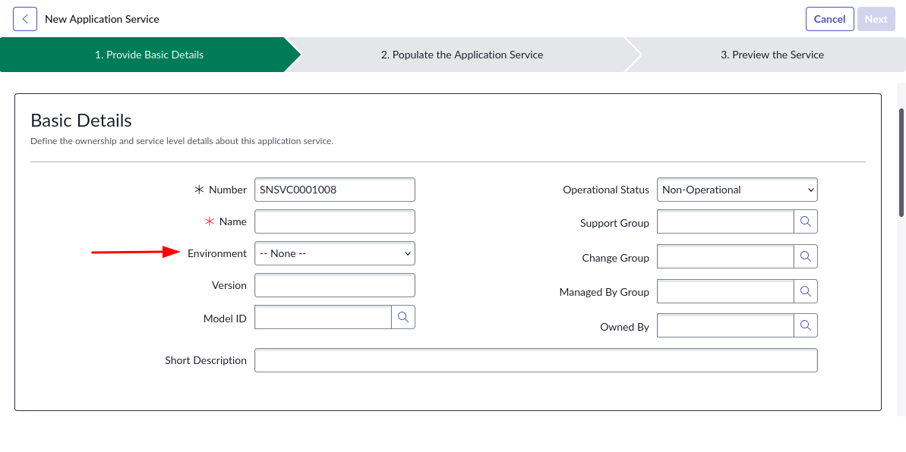
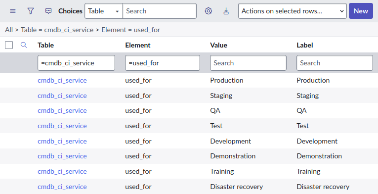

## The different fields 
It's common to use the ServiceNow CMDB to denote the kind of environment that a CI is in. I've found most companies will have entire separate networks for production and non-production systems.
*"This server hosts the DEV instance of Sharepoint."*
*"This database is used for training."*
*"That router is in the non-production network."*

In the ServiceNow CMDB, there are 3 fields you would think will allow you to do this: 
* Used for 
* Classification 
* Environment 

They look the same **but which one should you use?**

## Use the Environment field
You should use the **"Environment"** field. This is the field that ServiceNow recommends you use to denote to denote a CI's environment.

This is further reinforced by by the Service Builder, which wants you to use the "Environment" field.

ServiceNow describes the **Used for** field as a legacy field. I wouldn't recommend using it. 

This was confirmed by Scott Lemm, the Product Owner for the ServiceNow CMDB in this SN Community discussion.
> * used_for is a legacy attribute in ServiceNow CMDB and not present on all CMDB classes
> * The used_for label is quite possibly the worst label in all of ServiceNow CMDB. The industry refers to this data as "Environment". Due to the poor name, many customers didn't know this attribute existed. The #1 custom created attribute in ServiceNow CMDB is "Environment". 
> * The oob Environment attribute is our effort to right a wrong by providing an object that is available on all CMDB classes and labeled appropriately as "Environment". 
> Eventually, after customers have migrated from used_for to environment, we will deprecate the legacy used_for object. We recommend you utilize "Environment" in your operations.
https://www.servicenow.com/community/common-service-data-model-forum/application-service-class-quot-used-for-quot-vs-quot-environment/m-p/333595

This is also confirmed by other sources:
* [SN Support KB1115829](https://support.servicenow.com/kb?id=kb_article_view&sysparm_article=KB1115829) 
* [SN Community - Difference between Classification, Environment, and Used For](https://www.servicenow.com/community/cmdb-forum/difference-between-classification-environment-and-used-for/td-p/3299519) 

The **Classification** field is intended to be used in combination with the **Environment** field. 
E.g. **Environment** = "Development", **Classification** = "Disaster recovery"

However, it's possible for combination to not make sense, such as:
**Environment** = "Development", **Classification** = "Testing"
Use your common sense with these fields. 

## Adding more environment choices
What if you want to have more types of environment choices in the "Environment" field? Just add them! 

First, consider **copying** from the existing choices on the **Used for** field. Chances are good that the environment name you are after is one of those out-of-the-box choices. 

Otherwise, there shouldn't be an technical issues caused by creating additional environment choices. 

Normal development rules apply: don't create choices whimsically, make sure it fits your own Data Governance. 

## Comparing the fields 
|-| Environment | Used for | Classification | 
|---| --- | --- | --- | 
| Table | Available on any CI class | Only available on CI classes that extend from: <ul><li>Application [cmdb_ci_appl]</li><li>Server [cmdb_ci_server]</li><li>Service [cmdb_ci_service]</li></ul>| Only available on CI classes that extend from Server [cmdb_ci_server] | 
| Choices | <ul><li>Production</li><li>Development</li><li>Test</li></ul> | <ul><li>Production</li><li>Staging</li><li>QA</li><li>Test</li><li>Development</li><li>Demonstration</li><li>Training</li><li>Disaster recovery</li></ul> | <ul><li>Critical Infrastructure</li><li>Development</li><li>Development Test</li><li>Disaster Recovery</li><li>Production</li><li>UAT</li></ul> | 
| Introduced | Orlando CSDM release | Pre-Orlando release | New York CSDM release | 
| Description by ServiceNow | (not documented) | Used for: Business service supported by the server, such as production, staging, or quality assurance (QA). This attribute uses the Used for choice list field from the Service [cmdb_ci_service] table. [Link](https://www.servicenow.com/docs/r/washingtondc/servicenow-platform/configuration-management-database-cmdb/class-server.html) | Classification: Type of server, such as production, development, disaster recovery, or user acceptance testing (UAT). [Link](https://www.servicenow.com/docs/r/washingtondc/servicenow-platform/configuration-management-database-cmdb/class-server.html)| 
| Support | Supported | Legacy, use not recommended | Supported | 