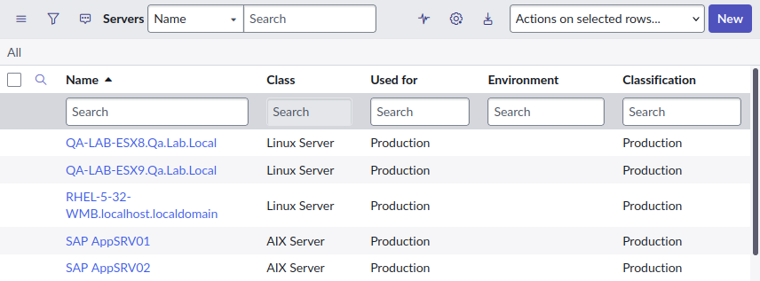

## The different fields 
It's common to use the ServiceNow CMDB to denote the kind of environment that a CI is in. I've found most companies will have entire separate networks for production and non-production systems.
*"This server hosts the DEV instance of Sharepoint."*
*"This database is used for training."*
*"That router is in the non-production network."*

In the ServiceNow CMDB, there are 3 fields you would think will allow you to do this: 
* Used for 
* Classification 
* Environment 

They look the same **but which one should you use?**

> You should use the **"Environment"** field. This is the field ServiceNow recommends you use to denote to denote a CI's environment

ServiceNow describes the **Used for** field as a legacy field. I wouldn't recommend using it. 
* [SN Support KB1115829](https://support.servicenow.com/kb?id=kb_article_view&sysparm_article=KB1115829) 
* [SN Community - Difference between Classification, Environment, and Used For](https://www.servicenow.com/community/cmdb-forum/difference-between-classification-environment-and-used-for/td-p/3299519) 

The **Classification** field is intended to be used in combination with the **Environment** field. 
For example, you could have a Server CI in "Development" **Environment** the is **Classified** as "Disaster recovery".

However, I must admit that I don't understand how a Server CI could have an **Environment** of "Production" and a **Classification** of "Development", that doesn't make sense. 

## Custom environment choice 
What if you want to have more types of environment choices in the "Environment" field? Just add them! 

First, consider **copying** from the existing choices on the **Used for** field. Chances are good that the environment name you are after is one of those out-of-the-box choices. 

Otherwise, there shouldn't be an technical issues caused by creating additional environment choices. Normal rules apply: don't create choices whimsically, make sure it fits your own Data Governance. 

## Comparing the fields 
|-| Environment | Used for | Classification | 
|---| --- | --- | --- | 
| Table | Available on any CI class | Only available on CI classes that extend from: <ul><li>Application [cmdb_ci_appl]</li><li>Server [cmdb_ci_server]</li><li>Service [cmdb_ci_service]</li></ul>| Only available on CI classes that extend from Server [cmdb_ci_server] | 
| Choices | <ul><li>Production</li><li>Development</li><li>Test</li></ul> | <ul><li>Production</li><li>Staging</li><li>QA</li><li>Test</li><li>Development</li><li>Demonstration</li><li>Training</li><li>Disaster recovery</li></ul> | <ul><li>Critical Infrastructure</li><li>Development</li><li>Development Test</li><li>Disaster Recovery</li><li>Production</li><li>UAT</li></ul> | 
| Introduced | Orlando CSDM release | Pre-Orlando release | New York CSDM release | 
| Description by ServiceNow | (not documented) | Used for: Business service supported by the server, such as production, staging, or quality assurance (QA). This attribute uses the Used for choice list field from the Service [cmdb_ci_service] table. [Link](https://www.servicenow.com/docs/r/washingtondc/servicenow-platform/configuration-management-database-cmdb/class-server.html) | Classification: Type of server, such as production, development, disaster recovery, or user acceptance testing (UAT). [Link](https://www.servicenow.com/docs/r/washingtondc/servicenow-platform/configuration-management-database-cmdb/class-server.html)| 
| Support | Supported | Legacy, use not recommended | Supported | 