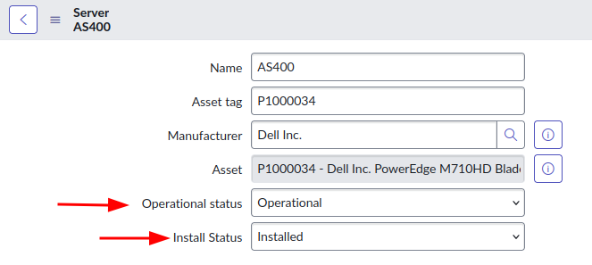
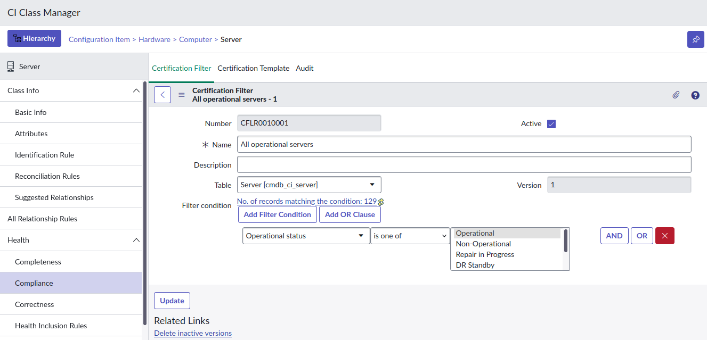
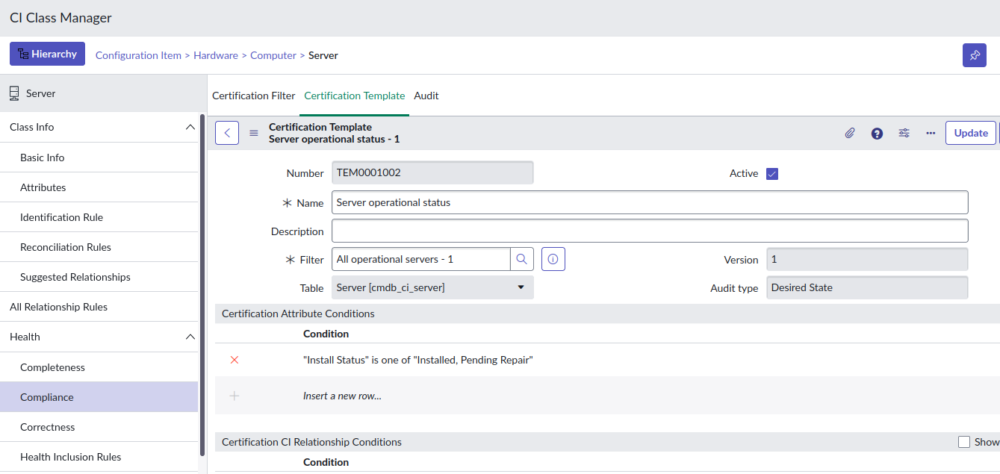
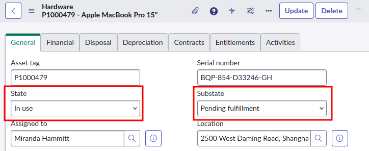
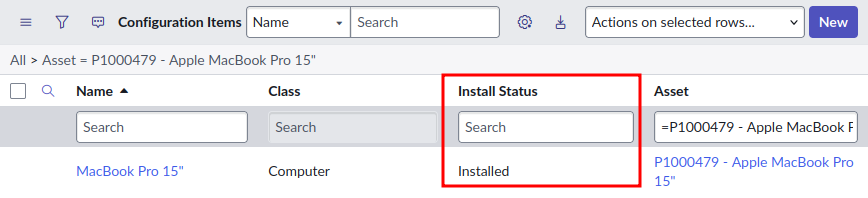
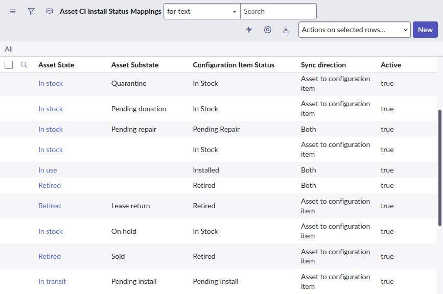
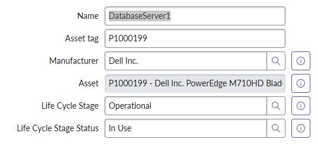

## Operational Status vs Install Status 

* **"Operational status"** denotes the operational or working status of the CI. This field is available for all CI classes, and is not synced between CI and Asset. 
* **"Install Status"** denotes the status of the CI's physical hardware. This field is available for all CI classes, and is synced between the CI and the linked Asset. 

If in doubt, use the **Operational Status** field to set the status of a CI. Leave the **Install Status** field for the Asset Management team to maintain. 

**Example 1 – a network router** 
In this example, you have a physical network router mounted in a rack in a datacenter. 
The **Operational status** denotes the status of the router as it fits into the rest of the infrastructure. E.g. "Operational" or "DR Standby". 
The **Install status** denotes the status of the hardware itself. E.g. "Installed". 

**Example 2 – a virtual server** 
In this example, you have a virtualized server within a VMware cloud of virtualized infrastructure.
The **Operational status** denotes the status of the virtual machine. E.g. "Operational". 
The **Install status** doesn't really matter in this example, because the device is virtual. Typically, there will be a Hardware Asset created automatically with the "Manufacturer" of "VMware", however its use is entirely optional. 

**Example 3 – a Service Offering** 
In this example, you have a non-technical CI such as a Service Offering. 
The **Operational status** denotes the status of the Service Offering. E.g. "Retired". 
Although the **Install status** field is available for these CI classes, it doesn't make much sense to use them. 

### Do they sync with each other? 
No, changes to either the Operational Status or Install Status fields will not update or sync with each other. 

If a CI's Operational Status is "Operational" and the Install Status is changed from "In use" to "Stolen", the Operational Status will remain as "Operational". 

I recommend creating CMDB Health Certification rules to highlight deviations between the Operational status and Install status fields. 

Here's an example that expects all Server CIs where the Operational Status is "Operational" to have the Install Status of either "Installed" or "Pending repair". 

### Not on the form
By default, neither the Operational Status or the Install Status fields are on the forms of most CI classes. I don't know why ServiceNow did this.

I recommend adding at least the Operational Status field any CI class that you'll be managing the state of, likely these ones:
* Servers [cmdb_ci_server]
* Network gear [cmdb_ci_netgear]
* Database servers [cmdb_ci_database]
* Printers [cmdb_ci_printer]

### Importing CI "State" from a spreadsheet 
If you have a big spreadsheet of CIs to import into the CMDB and it has a "State" column in it, I'd recommend importing it into the **Operational status** field. You should always double-check that this applies to your situation, however, the odds are good that it means the **Operational status**. 

In my experience, most of the time this value in the spreadsheet is denoting the operational status of the CI within the customer's IT infrastructure, and typically doesn't denote the status of the physical hardware. 

### Sync Install Status between Asset and CI 
The Install Status field is synced between Asset and CI. Changing the "State" [install_status] or "Substate" [substatus] fields on an the Asset will update the "Install status" [install_status] field on the linked CI. 

SN Docs - Map asset state and CI install status
https://www.servicenow.com/docs/r/it-asset-management/asset-management/t_CreateAssetandCIInstallStatusMapping.html 

However, the sync is complicated because it's not the same between Asset and CI. 

Assets use a combination of the fields "State" and "Substate". 

CIs just use the "Install status" field. 

The status mapping between Asset and CI is configured using the table "Asset CI Install Status Mappings" [alm_asset_ci_state_mapping]. 

Here's a list of Install Status states and substates from SN Docs. 
https://www.servicenow.com/docs/r/it-asset-management/asset-management/t_SettingAssetStatesAndSubstates.html

### Life Cycle Stage & Status 
Introduced in release of the **CSDM** plugin around the Rome release of ServiceNow, the **Life Cycle Stage** fields are replacements for the original Status fields (referred to as "legacy status fields"), including:
* Operational Status
* Install Status
* Hardware Status

These Life Cycle Stage fields align closely to the CSDM model and are available on all CIs including some tables withing the Foundation Data domain (e.g. Locations).

ServiceNow recommends migrating from the "legacy status fields" to the CSDM Life Cycle fields when implementing CSDM, and includes migration utilities to aid in the switch.

Not to be confused with the **CMDB CI Lifecycle Management** utility which is now deprecated.
https://www.servicenow.com/docs/r/servicenow-platform/configuration-management-database-cmdb/cmdb-ci-lifecycle-mgmt.html

Here are some resources for those interested in migrating from the Status fields to the CSDM Life Cycle fields.
* MyNow - CMDB - Lifecycle Stage and Status
 https://mynow.service-now.com/now/best-practices/assets/cmdb-lifecycle-stage-and-status
* SN Community discussion on the CI Life Cycle fields including SN employees and SN Community veterans.
 LifeCycle stage vs Status
 https://www.servicenow.com/community/cmdb-forum/lifecycle-stage-vs-status/m-p/245071 
* SN Docs - Activate life cycle migration
 https://www.servicenow.com/docs/r/washingtondc/servicenow-platform/common-service-data-model-csdm/activate-life-cycle-migration.html
* SN Docs - CMDB Data Management (talks about managing the CI Life Cycle fields)
 https://www.servicenow.com/docs/r/washingtondc/servicenow-platform/configuration-management-database-cmdb/cmdb-data-management.html
* SN Docs - Definition of life-cycle values for tangible/physical CIs
 https://www.servicenow.com/docs/r/servicenow-platform/common-service-data-model-csdm/csdm-lifecycle-df-tangible-physical.html

## Other status fields 
### Hardware Status & Substatus 
https://www.servicenow.com/docs/r/washingtondc/servicenow-platform/configuration-management-database-cmdb/class-hardware.html 

> Hardware Status is applicable for only hardware CIs( e.g servers, ). But, this isn't used anymore.  
> -  sachin_namjoshi 
> 
> https://www.servicenow.com/community/architect-forum/install-status-vs-hardware-status-vs-substatus-vs-operational/m-p/2243447 

### Firewall status 
ServiceNow Docs describes the field: 
> Firewall status = Internet or intranet facing server. 
> 
> https://www.servicenow.com/docs/r/washingtondc/servicenow-platform/configuration-management-database-cmdb/class-server.html 

It seems this field's purpose is to denote whether it is available: 
* only from inside of the network 
* from outside of the network from the internet 
* within the DMZ network 

I'm unsure how this field is set: it could be manually, or it could be done automatically as part of the "ServiceNow Firewall Audits and Reporting" application. I might explore this feature more in a future article. 

### Attestation status 
Used as part of the CI Attestation feature, this field denotes the CI's status in its attestation lifecycle. 

The CI Attestation feature enables users to "attest" their CIs. As CIs are imported into the CMDB, typically in bulk, the CI can be "attested" by an owner or a support engineer to say "yep, this CI is legitimate". 

SN Docs – CI Attestation 
https://www.servicenow.com/docs/r/washingtondc/servicenow-platform/configuration-management-database-cmdb/attesting-cis.html  