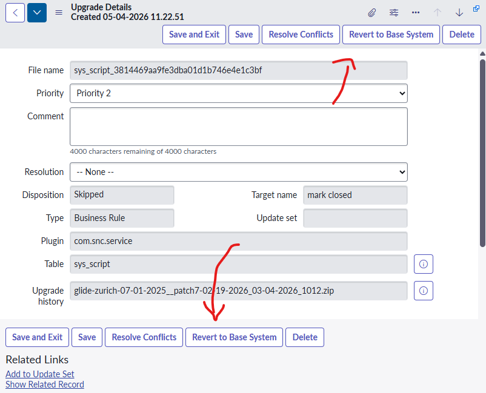
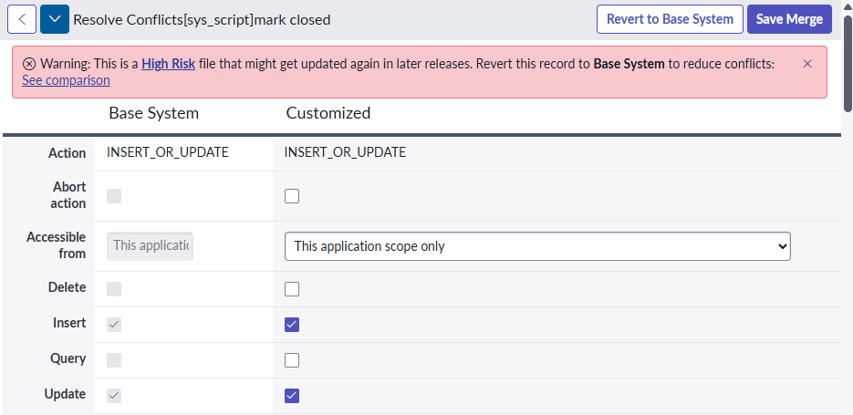
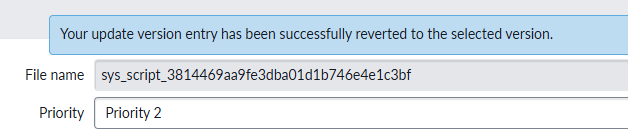
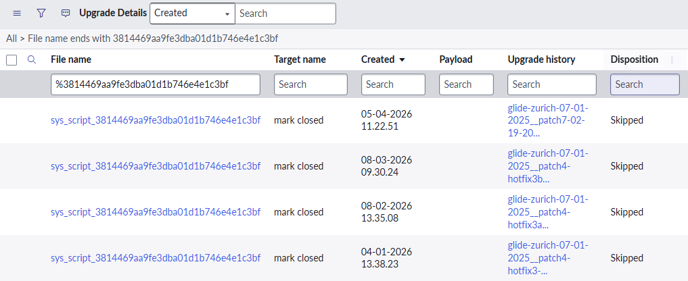
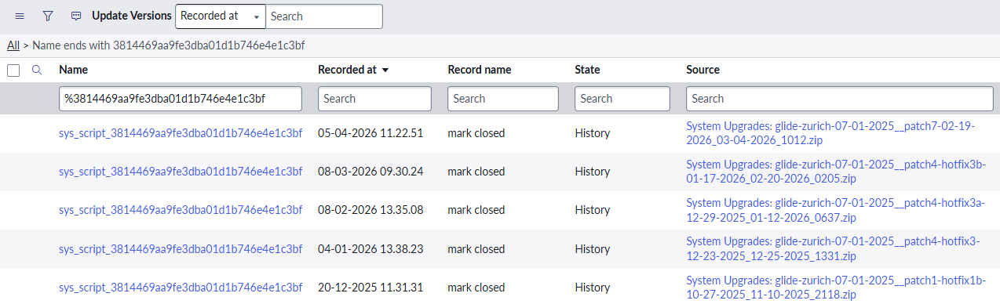
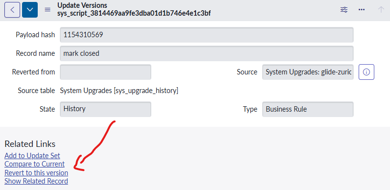
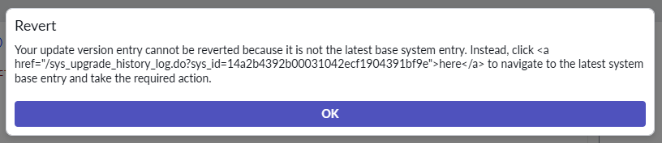

## The challenge
I've had a number of customers over the years that have wanted to revert something that they've customised back to baseline / out-of-the-box.

There's a few reasons why you'd want to do revert something back to baseline.
* Something has been modified so much it doesn't work anymore.
* Something keeps getting flagged as P1 and P2 skipped updates during an upgrade, and it's annoying to see.
* Something has been modified, but SN has flagged it as a high-risk component and it's affecting health scores because it's been touched.
* A part of a larger feature has been modified and won't be updated automatically during upgrades, causing unexpected issues and behaviour.

Whenever something is reverted back to baseline, it **must** make it upgrade-safe so that an upgrade won't flag it as a skipped update.

But how do you do it?

## Revert using Upgrade History 
You can revert records by searching for previous version in the **Upgrade Details [sys_upgrade_history_log]** table. This table will look familiar to admins, it's also where you'll find skipped updates.

This table will only have versions provided by ServiceNow or from the ServiceNow App Store. It will not contain changes made by the customer.

You can revert a record back to baseline by: 
1. Finding and opening the Upgrade Details record that you want to revert to. Try to search for the most recent version.
2. Click on "Revert to Base System".

E.g. the business rule "mark closed".

3. **Or** by clicking on **Resolve Conflicts**, and then click on **Revert to Base System**.

You'll get this message when your record has been reverted to the selected version. 

> The act of Reverting to Base System will be captured in an update set. 
> This is good, and this change can be promoted to other instances within the update set.

### Search by File name
You can search for your record in the Upgrade History table by searching the "File name" for your record, either:
* The file name ends with the sys_id of the record. 
 E.g. sys_script_c0e748b33bd32300b200655593efc4c7 
* The file name contains the table name / field name / display name. 
 E.g. sys_ui_list_incident_number 

For example, the business rule "mark closed".

### Search by Target name
Or, you can search the "Target name" field for the display name of the record. 
E.g. Find the business rule "mark closed" by searching the "Target name" field for "mark closed". 

Note that this method isn't always accurate, as many things can have the same name. 

## Revert using Versions 
You can also revert a record back to a baseline / out-of-the-box version by searching the **Update Versions [sys_update_version]** table. 

This table will include version provided by both ServiceNow and customisations made by the customer.

Similar to searching the Upgrade History table, you can search using the Update Versions table using the: 
* sys_id in the **Name** field 
* name in the **Name** field 
* name in the **Record Name** field 

To revert back to a selected version of a record: 
1. Open the **Update Version [sys_update_version]** record. 
1. Click on the **Revert to this version** button under Related Links. 

You might get this message if the version corresponds to an Upgrade History record. Follow the link, and revert using this Upgrade History record instead of the Update Version record. 

>Your update version entry cannot be reverted beacause it is not the latest base system entry. Instead, click here to navigate to the latest system base entry and take the required action.

## Reverting more than just records
There are other ways to revert complex features, including:
* Forms
* Related lists
* Flows

See the other posts in this series for more!