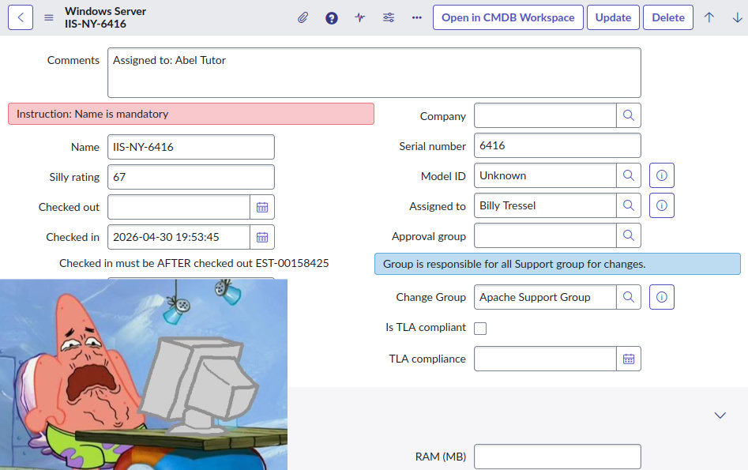
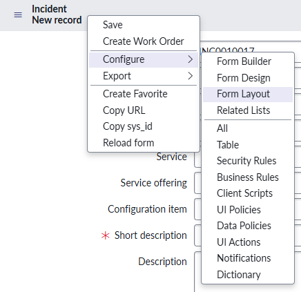
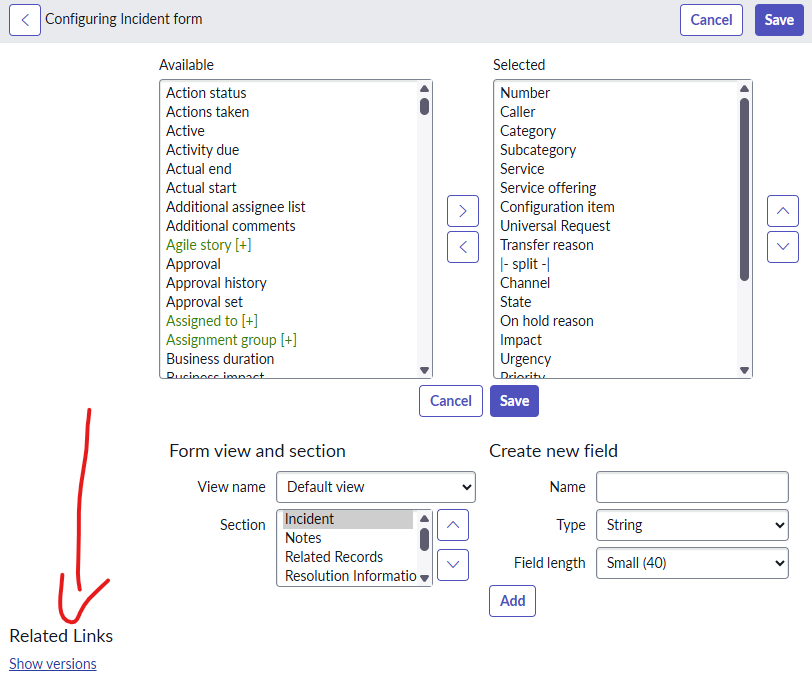
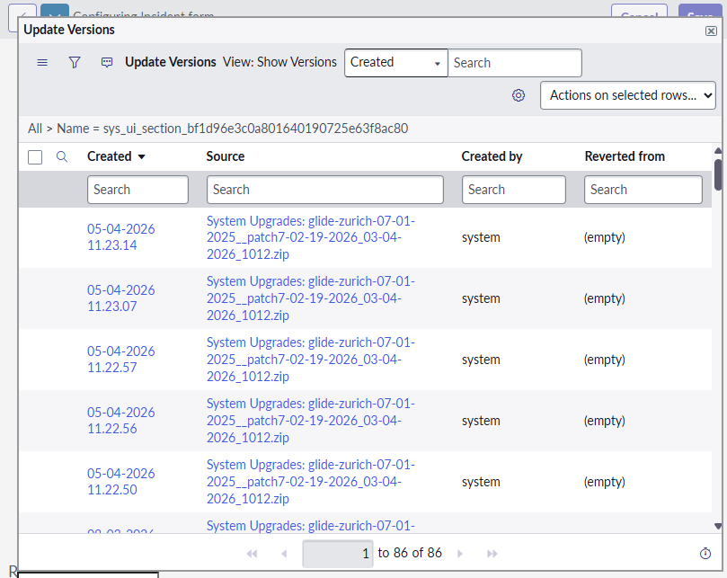
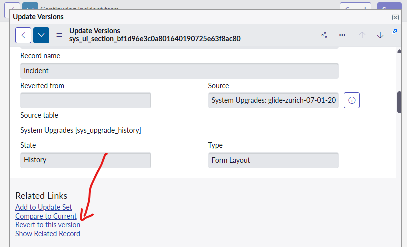
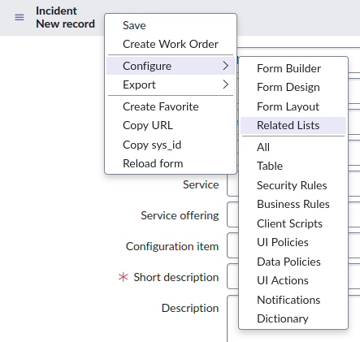
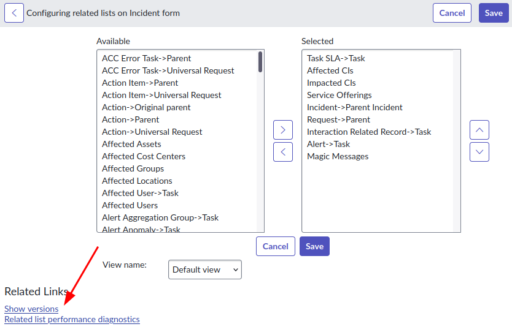
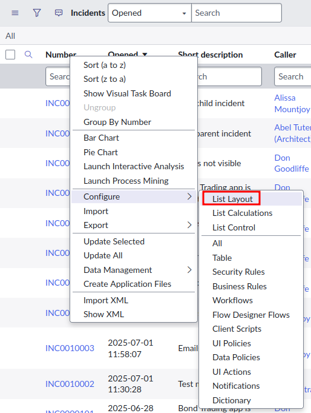
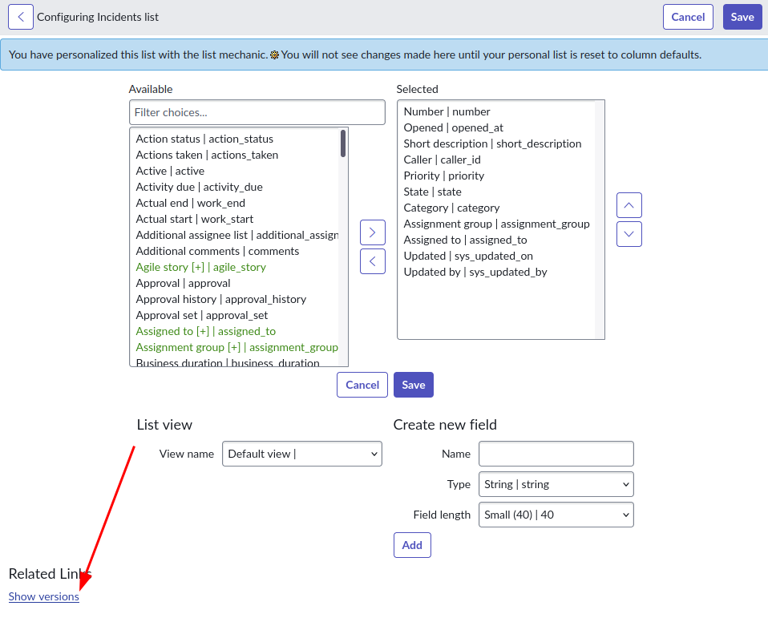

## The challenge
A common request I get from customers is that they've heavily modified a form in ServiceNow, and they'd like to revert it back to baseline / out-of-the-box.

Did you make huge changes to the **Windows Server** form and want to undo it?

You'll also want to prevent the modified forms showing up as **skipped updates** during upgrades.

But how do you do it? Is there an easier way than manually recreating the forms and lists?

## Revert a Form Layout 
You can revert a form layout back to baseline!

Form layouts in ServiceNow are more complex, and are made up of multiple records. We can't just revert individual records one-by-one, forms are made up of all sorts of records:
* UI Forms [sys_ui_form] 
* UI Sections [sys_ui_section] 
* UI Form Sections [sys_ui_form_section] 
* Form Elements [sys_ui_element] 
* Form Views [sys_ui_view] 

> Note: these instructions won't cover other form-related functionality, like UI Policies and Client Scripts. If you revert a form layout, don't forget to double-check that everything still works! 

### From the Form Layout page 
You can revert the form back to a previous version using the classic Form Layout page. 

1. Right-click on the top bar of the form you want to edit, then click on **Configure > Form Layout**. 

2. At the bottom of the **Form Layout** page, click on **Show Versions**. A pop-up of available versions will appear. 

3. Click on the baseline / out-of-the-box version you wish to revert to, then click on **Revert to this version**. 

4. Repeat this for each form / section / and view you wish to revert, and you're done! 

### Form Designer 
The Form Designer cannot be used to revert a form back to a previous version. 

### Form Builder 
The Form Builder cannot be used to revert a form back to a previous version. 

### Manually 
The tedious way to revert a form back to baseline is to do it manually. 
* In your PDI (Personal Developer Instance), open the form in the form designer. 
* In the target instance, open the form in the form designer. 
* Manually update the form layout on the target instance by looking at the form layout on your PDI. 

It's not fancy and not fast, but it will bring the form back to baseline. 

## Revert a Related List on a Form
Similar to reverting a form, a Related List can be reverted to a previous version by doing the following:

1. Right-click on the top bar of the form you want to edit, then click on **Configure > Related Lists**. 

2. At the bottom of the **Related Lists** page, click on **Show Versions**. A pop-up of available versions will appear. 

3. Click on the baseline / out-of-the-box version you wish to revert to, then click on **Revert to this version**. 

4. Repeat this for each view you wish to revert the related lists on, and BAM you're done!

## Revert a List Layout
Similar to reverting a form, a List Layout for a list can be reverted to a previous verion by doing the following:

1. In a list, right-click on a list header, and click on **Configure > List Layout**.

2. At the bottom of the **List layout** page, click on **Show Versions**. A pop-up of available versions will appear. 

3. Click on the baseline / out-of-the-box version you wish to revert to, then click on **Revert to this version**. 

4. Repeat this for each view you wish to revert the related lists on, and BAM you're done!